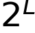
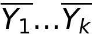
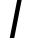
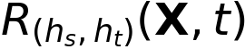
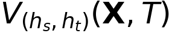
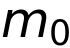
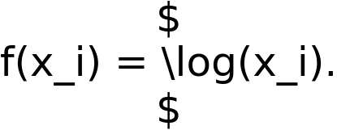
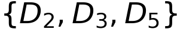
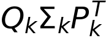
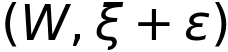

Медіана    середніх значень різних наборів    значень   . Можливо обмежити наближення в межах    з ймовірністю принаймні   . Це оцінювання також можна виконати за допомогою скетчу count–min, хоча з іншою межею.

2. Евклідову відстань між частотними підрахунками пари потоків можна оцінити як   . Евклідову відстань можна розглядати як лінійну комбінацію трьох різних скалярних добутків (включно з самодобутками) між частотними підрахунками двох потоків. Оскільки кожен скалярний добуток сам обмежений за допомогою обговореної вище "хитрості середнього-медіани", цей підхід можна використовувати для визначення меж подібної якості в цьому випадку також.

3. Як і скетч count–min, скетч AMS можна використовувати для оцінювання частотних значень. Для   -го унікального елемента потоку з частотою    добуток випадкової змінної    та    надає оцінку частоти.

$$
E[f_j] = r_j \cdot Q_i \tag{12.29}
$$

Середнє, медіана або комбінація середнього-медіани цих значень для різних компонентів скетчу    можуть бути повідомлені як надійна оцінка. Скетч AMS також можна використовувати для ідентифікації частих елементів у потоці даних.

Деякі запити, що вирішуються скетчами AMS та count–min, є подібними, хоча інші відрізняються. Межі, що надаються цими двома методами, також різні, хоча жоден з них не є строго кращим за інший у всіх сценаріях. Скетч count–min має перевагу в тому, що його легко інтуїтивно інтерпретувати завдяки його природній структурі даних хеш-таблиці. Внаслідок цього його можна більш природно інтегрувати в додатки інтелектуального аналізу даних, такі як кластеризація та класифікація, безшовним чином.

## 12.2.2.4 Алгоритм Флажоле–Мартіна для підрахунку унікальних елементів

Скетчі призначені для визначення статистики потоків, на яку впливають великі агреговані сигнали частих елементів. Однак вони не оптимізовані для оцінювання статистики потоків, на яку впливають рідкісні елементи. Проблеми, такі як підрахунок унікальних елементів, більш безпосередньо залежать від набагато більшої кількості рідкісних елементів у потоці даних. Підрахунок унікальних елементів можна ефективно виконати за допомогою алгоритму Флажоле–Мартіна.

Алгоритм Флажоле–Мартіна використовує хеш-функцію    для відображення заданого елемента    у потоці даних на ціле число в діапазоні   . Значення    вибирається достатньо великим, щоб    було верхньою межею для кількості унікальних елементів. Зазвичай значення    вибирається рівним 64 для зручності реалізації, і тому що значення    достатньо велике для більшості практичних застосувань. Таким чином, бінарне представлення цілого числа    матиме довжину   . Визначається позиція найправішого біта 1 у бінарному представленні цілого числа   . Таким чином, значення    представляє кількість нульових бітів у кінці цього бінарного представлення. Нехай    буде максимальним значенням    для всіх елементів потоку. Значення    можна підтримувати інкрементально в сценарії потоку, застосовуючи хеш-функцію до кожного вхідного елемента потоку, визначаючи його найправіший біт і потім оновлюючи   . Ключова ідея в алгоритмі Флажоле–Мартіна полягає в тому, що динамічно підтримуване значення    логарифмічно пов'язане з кількістю унікальних елементів, зустрінутих досі в потоці.
Інтуїція за цим результатом досить проста. Для рівномірно розподіленої хеш-функції, ймовірність \( R \) кінцевих нулів у бінарному представленні елемента потоку дорівнює \( 2^{-R-1} \). Отже, для \( n \) різних елементів та фіксованого значення \( R \), очікувана кількість разів, коли досягається рівно \( R \) кінцевих нулів, дорівнює \( 2^{-R-1} \cdot n \). Таким чином, для значень \( R \), більших за \( \log(n) \), очікувана кількість таких бітових рядків експоненціально зменшується до менше 1. Звичайно, в нашому застосуванні значення \( R \) не є фіксованим, а є випадковою величиною, яка генерується результатом хеш-функції. Було ретельно показано, що очікуване значення \( E[R_{\text{max}}] \) максимального значення \( R \) для всіх елементів потоку логарифмічно пов'язане з кількістю різних елементів наступним чином:

(12.30)

Стандартне відхилення становить \( \sigma (R_{\text{max}}) = 1.12 \). Отже, значення \( 2^{R_{\text{max}}} / \phi \) надає оцінку для кількості різних елементів \( n \). Для подальшого покращення оцінки \( R_{\text{max}} \) можуть бути використані наступні методи:

1. Можуть бути використані кілька хеш-функцій, і використовується середнє значення \( R_{\text{max}} \) для різних хеш-функцій.

2. Середні значення все ще дещо сприйнятливі до великих варіацій. Тому може бути використаний "трюк середнього-медіани". Повідомляються медіани набору середніх значень. Зверніть увагу, що це схоже на трюк, який використовується в скетчі AMS. Як і в тому випадку, комбінація нерівності Чебишева та границь Чернова може бути використана для встановлення якісних гарантій.

Слід зазначити, що фільтр Блума також може бути використаний для оцінки кількості різних елементів. Однак, фільтр Блума не є ефективним за використанням пам'яті способом підрахунку кількості різних елементів, коли не потрібні запити на членство в множині.

## 12.3 Видобування частих шаблонів у потоках даних

Проблема видобування частих шаблонів у потоках даних вивчається в контексті двох різних сценаріїв. Перший сценарій - це сценарій масивної області, в якому кількість можливих елементів дуже велика. У таких випадках навіть проблема знаходження частих елементів стає складною. Часті елементи також називаються важливими елементами. Другий випадок - це звичайний сценарій великої (але керованої) кількості елементів, які поміщаються в оперативну пам'ять. У таких випадках проблема частих елементів більше не є настільки цікавою, оскільки часті підрахунки можуть бути безпосередньо підтримані в масиві. У таких випадках більше цікавляться визначенням частих шаблонів. Це складна проблема, оскільки більшість алгоритмів видобування частих шаблонів вимагають кількох проходів по всьому наборі даних. Обмеження одного проходу в сценарії потоку ускладнює це. Нижче будуть описані два різні підходи. Перший з цих підходів використовує загальні структури синопсису у поєднанні з традиційними алгоритмами видобування частих шаблонів, а другий розробляє версії алгоритмів видобування частих шаблонів для потоків.

### 12.3.1 Використання структур синопсису

Структури синопсису можуть бути ефективно використані в більшості задач потокового видобування даних, включаючи видобування частих шаблонів. У контексті методів видобування частих шаблонів структури синопсису особливо привабливі завдяки можливості використовувати більш широкий спектр алгоритмів або для включення тимчасового згасання в процес видобування частих шаблонів.
### 12.3.1.1 Вибірка резервуару

Вибірка резервуару є найбільш гнучким підходом для видобування частих шаблонів у потоках даних. Її можна використовувати як для видобування частих елементів (у сценарії масивної області), так і для видобування частих шаблонів. Основна ідея використання вибірки резервуару проста:

1. Підтримувати вибірку резервуару    з потоку даних.
2. Застосувати алгоритм видобування частих шаблонів до вибірки резервуару    і повідомити про знайдені шаблони.

Можливо отримати якісні гарантії щодо видобутих частих шаблонів як функцію від розміру вибірки   . Ймовірність того, що шаблон буде хибно позитивним, можна визначити за допомогою границі Чернова. Використовуючи дещо нижчі порогові значення підтримки, також можна гарантовано зменшити кількість хибно негативних результатів. У бібліографічних нотатках містяться посилання на такі гарантії. Вибірка резервуару має кілька переваг гнучкості завдяки чіткому розділенню процесів вибірки та видобування. Практично будь-який ефективний алгоритм видобування частих шаблонів можна використовувати на резидентній у пам'яті вибірці резервуару. Крім того, можна застосовувати різні варіації алгоритмів видобування шаблонів, такі як видобування обмежених шаблонів або видобування цікавих шаблонів. Відстеження концептуального дрейфу також відносно просте. Використання зміщеної вибірки резервуару з готовими методами видобування частих шаблонів перетворюється на зважене визначення підтримки з урахуванням старіння.

### 12.3.1.2 Скетчі

Скетчі можна використовувати для визначення частих елементів, хоча їх не так легко використовувати для визначення частих наборів елементів. Основна ідея полягає в тому, що скетчі, як правило, краще оцінюють частоти більш частих елементів на відносній основі. Це пов'язано з тим, що границя оцінки частоти будь-якого елемента є абсолютною, в якій похибка залежить від сукупної частоти елементів потоку, а не від частоти самого елемента. Це видно з Леми 12.2.3. Внаслідок цього частоти найбільш частих елементів, як правило, можна оцінити більш точно на відносній основі. Як скетч AMS, так і скетч count-min можна використовувати для визначення найбільш частих елементів. У бібліографічних нотатках містяться посилання на деякі з цих алгоритмів.

### 12.3.2 Алгоритм втрачаючого підрахунку

Алгоритм втрачаючого підрахунку можна використовувати як для підрахунку частих елементів, так і для підрахунку частих наборів елементів. Цей підхід ділить потік на сегменти    таким чином, що кожен сегмент    має розмір   . Параметр    - це задана користувачем допустима похибка.

Спочатку буде описано простішу задачу видобування частих елементів. Алгоритм підтримує частоти всіх елементів у масиві та збільшує їх, коли надходять нові елементи. Якщо кількість різних елементів не дуже велика, можна підтримувати всі підрахунки та повідомляти про часті елементи. Проблема виникає, коли доступний загальний простір менший, ніж потрібно для підтримки підрахунків різних елементів. У таких випадках, коли досягається межа сегмента   , нечасті елементи видаляються. Це призводить до видалення багатьох елементів, оскільки переважна більшість елементів у потоці є нечастими на практиці. Як вирішити, які елементи слід видалити, щоб зберегти обмеження якості на апроксимацію? Для цього використовується декрементний трюк.

Коли досягається межа сегмента   , підрахунок частоти кожного елемента в масиві зменшується на 1. Після зменшення елементи з нульовими частотами видаляються з
Масив. Розгляньмо ситуацію, коли вже оброблено n елементів. Оскільки кожен сегмент містить w елементів, загалом було оброблено    сегментів. Це означає, що будь-який конкретний елемент був зменшений не більше, ніж    разів. Отже, якщо до підрахунків елементів після обробки n елементів додати   , то жоден підрахунок не буде недооцінений. Крім того, це добра переоцінка частоти, пропорційна заданій користувачем терпимості   . Якщо часті елементи будуть повідомлятися з використанням цієї переоцінки, це може призвести до деяких хибно позитивних результатів, але не буде хибно негативних.

За деяких припущень щодо рівномірності було показано, що алгоритм втратного підрахунку вимагає    простору.

Цей підхід можна узагальнити на випадок частих шаблонів шляхом групування декількох сегментів розміром   . У цьому випадку підтримуються масиви, що містять підрахунки шаблонів (а не елементів). Однак, очевидно, що шаблони не можна ефективно генерувати з окремих транзакцій. Ідея полягає в тому, щоб згрупувати    сегментів, які завантажуються в основну пам'ять. Значення    визначається на основі доступної пам'яті. Коли    сегментів завантажено, часті шаблони з (абсолютною) підтримкою принаймні    визначаються за допомогою будь-якого алгоритму пошуку частих шаблонів, що базується на пам'яті. Спочатку всі старі підрахунки в масиві зменшуються на   , а потім підрахунки відповідних шаблонів з поточного сегмента додаються до масиву. Ті наборі елементів, підтримка яких дорівнює нулю або є негативною, видаляються з масиву. Протягом усього процесу обробки потоку довжиною n підрахунок будь-якого набору елементів зменшується не більше, ніж на   . Отже, додавши    до всіх підрахунків масиву в кінці процесу, жоден підрахунок не буде недооцінений. Переоцінка така ж, як і в попередньому випадку. Таким чином, можна повідомляти про часті шаблони без хибно негативних результатів, а хибно позитивні результати регулюються заданою користувачем терпимістю   . Концептуально, основна відмінність цього алгоритму підрахунку частих наборів елементів від згаданого вище алгоритму підрахунку частих елементів полягає у використанні групування. Основна мета групування - зменшити кількість частих шаблонів, згенерованих на рівні підтримки    під час застосування алгоритму пошуку частих шаблонів. Якщо не використовувати групування, то буде згенеровано велику кількість нерелевантних частих шаблонів на рівні абсолютної підтримки 1.

Основний недолік втратного підрахунку полягає в тому, що він не може адаптуватися до дрейфу концепції. У цьому сенсі резервне вибірка має ряд переваг над алгоритмом втратного підрахунку.

# 12.4 Кластеризація потоків даних

Проблема кластеризації особливо важлива в сценарії потоку даних через її здатність надавати компактний синопсис потоку даних. Кластеризація потоку даних часто може використовуватися як евристична заміна резервного вибірки, особливо якщо використовується детальна кластеризація. З цих причин кластеризація потоків часто використовується як попередник для інших застосувань, таких як класифікація потоків. Далі буде розглянуто кілька репрезентативних алгоритмів кластеризації потоків.

## 12.4.1 Алгоритм STREAM

Алгоритм STREAM базується на методології кластеризації k-медіан. Основна ідея полягає в розбитті потоку на менші сегменти, що вміщуються в пам'яті. Таким чином, вихідний потік даних    ділиться на сегменти   . Кожен сегмент містить не більше    точок даних. Значення    фіксується на основі заданого бюджету пам'яті.

Оскільки кожен сегмент    вміщується в основній пам'яті, до нього можна застосувати більш складний алгоритм кластеризації, не турбуючись про обмеження одного проходу. Можна використати різноманітні
Розглянемо різні алгоритми стилю   -медіан для цієї мети. В алгоритмах   -медіан вибирається набір    з    представників з кожного чанку   , і кожна точка в    призначається до найближчого представника. Метою є вибір представників для мінімізації суми квадратів відстаней (SSQ) призначених даних точок до цих представників. Для набору з    даних точок    у сегменті    і набору з    представників   , цільова функція визначається наступним чином:
$$
\text{Objective}(S, \mathcal{Y}) = \sum_{X_i \in S, X_i \overset{\leftarrow}{Y_j}} \text{dist}(X_i, Y_j). \tag{12.31}
$$
Оператор призначення позначається    вище. Квадрат відстані між даною точкою та призначеним їй центром кластера позначається   , де запис даних    призначений до представника   . В принципі, будь-який алгоритм розбиття, такий як   -means або   -medoids, може бути застосований до сегмента    для визначення представників   . Для цілей обговорення цей алгоритм буде розглядатися як чорний ящик.

Після обробки першого сегмента    ми тепер маємо набір з    медіан, які зберігаються. Кількість точок, призначених до кожного представника, зберігається як "вага" для цього представника. Такі представники вважаються представниками рівня 1. Наступний сегмент    обробляється незалежно для знаходження його    оптимальних медіанних представників. Таким чином, після обробки другого сегмента буде    таких представників. Отже, вимога до пам'яті для зберігання представників також зростає з часом, і після обробки    сегментів буде загалом    представників. Коли кількість представників перевищує   , застосовується друге кластерування до цього набору з    точок, за винятком того, що збережені ваги на представниках також використовуються в процесі кластеризації. Результуючі представники зберігаються як представники рівня 2. Загалом, коли кількість представників рівня    досягає   , вони перетворюються на    представників рівня   . Таким чином, процес призведе до збільшення кількості представників усіх рівнів, хоча кількість представників на вищих рівнях буде зростати експоненціально повільніше, ніж на нижчих рівнях. Наприкінці обробки всього потоку даних (або коли виникає конкретна потреба в результаті кластеризації), всі залишкові представники різних рівнів кластеризуються разом в одному фінальному застосуванні підпрограми   -медіан.

Конкретний вибір алгоритму, що використовується для задачі   -медіан, є критичним для забезпечення високоякісної кластеризації. Іншим фактором, що впливає на якість кінцевого результату, є ефект розкладання задачі на чанки з подальшою ієрархічною кластеризацією. Як таке розкладання задачі впливає на кінцеву якість результату? У роботі STREAM [240] було показано, що кінцева якість результату не може бути довільно гіршою, ніж конкретна підпрограма, яка використовується на проміжному етапі для кластеризації   -медіан.

#### Лема 12.4.1
Нехай підпрограма, що використовується для кластеризації   -медіан в алгоритмі STREAM, має фактор апроксимації   . Тоді алгоритм STREAM матиме фактор апроксимації не гірший за   .

Можливі різні рішення для задачі   -медіан. В принципі, практично будь-який алгоритм апроксимації може бути використаний як чорний ящик. Особливо ефективним рішенням є задача розміщення об'єктів. Читачеві пропонується звернутися до бібліографічних нотаток для посилань на відповідний підхід.
Основним обмеженням алгоритму STREAM є те, що він не дуже чутливий до еволюції в основному потоці даних. У багатьох випадках шаблони в основному потоці можуть еволюціонувати та значно змінюватися. Тому критично важливо, щоб процес кластеризації міг адаптуватися до таких змін і надавати інформацію за різними часовими горизонтами. У цьому сенсі алгоритм CluStream здатний забезпечити значно кращу інформацію на різних рівнях часової гранулярності.

## 12.4.2 Алгоритм CluStream

Дрейф концепції в потоці даних, що еволюціонує, значно змінює кластери з часом. Кластери за минулий день дуже відрізняються від кластерів за минулий місяць. У багатьох додатках інтелектуального аналізу даних аналітики можуть бажати мати гнучкість визначати кластери на основі одного або кількох часових горизонтів, які невідомі на початку процесу кластеризації потоку. Оскільки потік даних природно накладає одноразове обмеження на розробку алгоритмів, обчислювати кластери за різними часовими горизонтами за допомогою традиційних алгоритмів важко. Пряме розширення алгоритму STREAM на такий випадок вимагало б одночасного підтримання проміжних результатів алгоритмів кластеризації за всіма можливими часовими горизонтами. Обчислювальне навантаження такого підходу зростає з прогресуванням потоку даних і може швидко стати вузьким місцем для онлайн-реалізації.

Природним підходом до вирішення цієї проблеми є застосування процесу кластеризації з дворівневою методологією, що включає онлайн-етап мікрокластеризації та офлайн-етап макрокластеризації. Онлайн-етап мікрокластеризації обробляє потік у режимі реального часу для безперервного підтримання узагальнених, але детальних статистичних даних кластерів потоку. Вони називаються мікрокластерами. Офлайн-етап макрокластеризації далі узагальнює ці детальні кластери, щоб надати користувачеві більш стисле розуміння кластерів за різними часовими горизонтами та рівнями часової гранулярності. Це досягається шляхом збереження достатньо детальної статистики в мікрокластерах, щоб можна було повторно кластеризувати ці детальні представлення за заданими користувачем часовими горизонтами.

### 12.4.2.1 Визначення мікрокластера

Припускається, що багатовимірні записи в потоці даних позначаються як   , що надходять у часові мітки   . Кожен    є багатовимірним записом, що містить    вимірів, позначених як   . Мікрокластери захоплюють узагальнену статистику потоку даних для полегшення кластеризації та аналізу за різними часовими горизонтами. Ця узагальнена статистика визначається наступними структурами:

1. **Мікрокластери**: Мікрокластери визначаються як часове розширення вектора ознак кластера, використаного в алгоритмі BIRCH з розділу 7. Цю концепцію можна розглядати як тимчасово оптимізоване представлення вектора CF, спеціально розроблене для сценарію потоку. Для досягнення цієї мети мікрокластери містять часові статистичні дані, а також статистику ознак.

2. **Пірамідальна часова рамка**: Мікрокластери зберігаються в моментальних знімках у часі, які слідують пірамідальному шаблону. Цей шаблон забезпечує ефективний компроміс між вимогами до сховища та здатністю відновлювати узагальнену статистику з різних часових горизонтів. Це важливо для забезпечення можливості повторної кластеризації даних за різними часовими горизонтами.

Мікрокластери визначаються наступним чином.
Визначення 12.4.1 Мікрокластер для набору   -вимірних точок    з часовими мітками    - це   -кортеж   , де    і    відповідають векторам з    записів. Визначення кожного з цих записів є таким:

1. Для кожного виміру сума квадратів значень даних зберігається в   . Таким чином,    містить    значень.   -й запис    дорівнює   .

2. Для кожного виміру сума значень даних зберігається в   . Таким чином,    містить    значень.   -й запис    дорівнює   .

3. Сума квадратів часових міток    зберігається в   .

4. Сума часових міток    зберігається в   .

5. Кількість точок даних зберігається в   .

Важлива властивість мікрокластерів полягає в тому, що вони є адитивними. Іншими словами, мікрокластери можна оновлювати за допомогою чисто адитивних операцій. Зверніть увагу, що кожну з    компонентів мікрокластера можна виразити як лінійно роздільну суму над складовими точками даних у мікрокластері. Це важлива властивість для ефективного підтримання мікрокластерів у сценарії онлайн-потоку. Коли точка даних    додається до мікрокластера, відповідні статистики точки даних    потрібно додати до кожної з    компонентів. Аналогічно, мікрокластери для періоду потоку    можна отримати, відняти мікрокластери в момент часу    від тих, що в момент часу   . Ця властивість важлива для можливості обчислення мікрокластерів вищого рівня за довільним часовим горизонтом    з мікрокластерів, збережених у різні моменти часу.

### 12.4.2.2 Алгоритм мікрокластеризації

Алгоритм кластеризації потоку даних може генерувати приблизні кластери в будь-якому заданому користувачем періоді історії від поточного моменту. Це досягається шляхом зберігання мікрокластерів у певні моменти в потоці, які називаються знімками. Водночас алгоритм завжди підтримує поточний знімок мікрокластерів. Адитивна властивість може бути використана для витягування мікрокластерів з будь-якого часового горизонту. До цього представлення застосовується фаза макрокластеризації.

Вхідними даними для алгоритму є кількість мікрокластерів, позначена як   . Онлайн-фаза алгоритму працює ітеративно, завжди підтримуючи поточний набір мікрокластерів. Коли надходить нова точка даних   , мікрокластери оновлюються для відображення змін. Кожна точка даних або повинна бути поглинута мікрокластером, або її потрібно помістити в окремий кластер. Перша перевага - поглинути точку даних у поточний мікрокластер. Визначається відстань точки даних до поточних центроїдів мікрокластерів   . Значення відстані точки даних    до центроїду мікрокластера    позначається як   . Оскільки центроїд мікрокластера можна вивести з вектора ознак кластера, це значення відстані можна легко обчислити. Визначається найближчий центроїд   . Точка даних    призначається своєму найближчому кластеру   , якщо тільки не буде вирішено, що точка даних "природно" не належить до цього (або будь-якого іншого) мікрокластера. У таких випадках точці даних    потрібно призначити (новий) мікрокластер власний. Тому, перш ніж призначити точку даних мікрокластеру, спочатку потрібно вирішити, чи природно вона належить до свого найближчого центроїду мікрокластера   .
Щоб прийняти це рішення, використовується векторна ознака кластера    для визначення, чи потрапляє ця точка даних у максимальну межу мікрокластера   . Якщо так, то точка даних    додається до мікрокластера    з використанням властивості адитивності мікрокластерів. Максимальна межа мікрокластера    визначається як фактор    середньоквадратичного відхилення точок даних у    від центроїда. Значення    є параметром, визначеним користувачем, і зазвичай встановлюється на 3.

Якщо точка даних не лежить у межах максимальної межі найближчого мікрокластера, то необхідно створити новий мікрокластер, що містить точку даних   . Однак, щоб створити цей новий мікрокластер, кількість інших мікрокластерів повинна бути зменшена на 1, щоб звільнити доступну пам'ять. Це можна досягти шляхом видалення старого мікрокластера або об'єднання двох старих кластерів. Це рішення приймається шляхом перевірки застарілості різних кластерів та кількості точок у них. Статистика часових міток мікрокластерів перевіряється для визначення, чи один із них є "достатньо" застарілим, щоб заслуговувати на видалення. Якщо це не так, то ініціюється об'єднання двох мікрокластерів.

Як визначається застарілість мікрокластера? Мікрокластери використовуються для апроксимації середнього часу останніх    точок даних кластера   . Це значення не відоме явно, оскільки останні    точок даних не зберігаються явно, щоб мінімізувати вимоги до пам'яті. Середнє значення    та дисперсія    часових міток у мікрокластері можуть бути використані разом із припущенням нормального розподілу розподілу часових міток для оцінки цього значення. Таким чином, якщо кластер містить    точок даних, то   -й процентиль нормального розподілу з середнім    та дисперсією    може бути використаний як оцінка. Це значення називається відповідною міткою часу кластера   . Зверніть увагу, що    та    можуть бути обчислені з часових компонентів векторів ознак кластера. Коли найменша така відповідна мітка часу будь-якого мікрокластера опускається нижче порогового значення   , визначеного користувачем, його можна видалити. У випадках, коли жоден мікрокластер не може бути безпечно видалений, найближчі мікрокластери об'єднуються. Операція об'єднання може бути ефективно виконана завдяки існуванню вектора ознак кластера. Відстані між мікрокластерами можна легко обчислити за допомогою вектора ознак кластера. Коли два мікрокластери об'єднуються, їхня статистика додається разом завдяки властивості адитивності мікрокластерів.

## 12.4.2.3 Пірамідальна часова рамка

Статистика мікрокластерів періодично зберігається для забезпечення аналізу кластерів, специфічного для горизонту. Це обслуговування виконується під час фази мікрокластеризації. У цьому підході знімки мікрокластерів зберігаються з різним рівнем деталізації залежно від актуальності знімка. Знімки класифікуються за різними порядками, які можуть варіюватися від 1 до   , де    - час, що минув з початку потоку. Порядок знімка регулює рівень часової деталізації, на якому він зберігається, відповідно до наступних правил:

- Знімки   -го порядку зберігаються з інтервалами часу   , де    - ціле число, і   . Зокрема, кожен знімок   -го порядку зберігається, коли значення годинника ділиться рівно на   .

- У будь-який заданий момент часу зберігаються лише останні    знімків порядку   .

Наведене вище визначення дозволяє значну надмірність у зберіганні знімків. Наприклад, час годинника 8 ділиться на    та    (де   ). Отже, стан мікрокластерів у момент часу годинника 8 одночасно відповідає знімкам порядку 0, порядку 1, порядку 2 та порядку 3. З точки зору реалізації знімок потрібно підтримувати лише один раз.
Таблиця 12.2: Приклад [39] збережених знімків для    та   

| Порядок знімків | Часові мітки (останні п'ять знімків) |
|-----------------|--------------------------------------|
| 0               | 55 54 53 52 51                       |
| 1               | 54 52 50 48 46                       |
| 2               | 52 48 44 40 36                       |
| 3               | 48 40 32 24 16                       |
| 4               | 48 32 16                             |
| 5               | 32                                   |

[ілюстрація, сторінка 416]

Рисунок 12.7: Нещодавні знімки зберігаються частіше за допомогою пірамідальної часової рамки

Для ілюстрації знімків буде використано приклад. Розглянемо випадок, коли потік даних працював, починаючи з часової мітки 1, і використовується    та   . Отже,    знімків кожного порядку зберігаються. Тоді, при часовій мітці 55, зберігаються знімки з часовими мітками, проілюстрованими в Таблиці 12.2. Хоча деякі знімки в цьому випадку є надлишковими, вони не зберігаються надлишковим способом. Відповідна модель зберігання проілюстрована на Рис. 12.7. Очевидно, що нещодавні знімки зберігаються частіше в пірамідальній моделі зберігання.

Наступні спостереження є справедливими в будь-який момент часу протягом процесу видобування даних з потоку:

- Максимальний порядок будь-якого збереженого знімка в момент часу    одиниць часу з початку процесу видобування даних з потоку є   .
- Максимальна кількість збережених знімків у момент часу    одиниць часу з початку процесу видобування даних з потоку є   .
- Для будь-якого заданого користувачем часового горизонту    можна знайти принаймні один збережений знімок, який відповідає горизонту довжиною в межах фактора    одиниць від бажаного значення   . Ця властивість є важливою, оскільки статистику мікрокластерів для часового горизонту    можна побудувати, віднявши статистику в момент часу    від статистики в момент часу   . Таким чином, можна використати мікрокластер в приблизній часовій локальності   . Це дозволяє приблизно кластеризувати точки потоку даних в межах довільного часового горизонту    з використанням збереженої пірамідальної моделі статистики мікрокластерів.

Для більших значень    часовий горизонт можна наблизити з бажаною точністю. Буде корисно використати приклад для ілюстрації поєднання ефективності та компактності, досягнутих за допомогою пірамідальної моделі зберігання знімків. Наприклад, вибравши
## 12.4.3 Масивне кластерування потоків даних

Як обговорювалося раніше, сценарій з масивним доменом є поширеним у контексті потоків даних. У багатьох випадках може знадобитися працювати з багатовимірним потоком даних, в якому окремі атрибути беруться з масивного домену можливих значень. У таких випадках аналіз потоків стає набагато складнішим, оскільки "стислі" підсумки кластерів стають більш ресурсномісткими. Це також є мотивацією для багатьох структур синопсису, таких як фільтр Блума, скетч count–min, скетч AMS та алгоритм Флажоле–Мартіна.

Проблема кластеризації даних також стає більш складною в сценарії з масивним доменом через складність підтримки стислої статистики кластерів. Нещодавно був розроблений метод CSketch для кластеризації потоків даних з масивним доменом. Ідея цього методу полягає у використанні скетчу count–min для зберігання частот комбінацій атрибут–значення в кожному кластері. Таким чином, кількість використаних скетчів count–min дорівнює кількості кластерів. Застосовується онлайн-кластеризація у стилі k-means, в якій скетч використовується як представник для (дискретних) атрибутів у кластері. Для будь-якої вхідної точки даних обчислюється скалярний добуток щодо кожного кластера.

Обчислення виконується наступним чином. Для кожної комбінації атрибут–значення в d-вимірах застосовується функція хешування h_r(·) до неї для певного значення r. Визначається частота відповідної комірки скетчу. Частоти всіх відповідних комірок скетчу для d різних вимірів додаються разом. Це дає оцінку скалярного добутку. Для отримання більш точної оцінки використовується мінімальне значення за різними функціями хешування (різні значення r). Скалярний добуток ділиться на загальну частоту елементів у кластері, щоб уникнути зміщення до кластерів з багатьма точками даних.

Це обчислення можна виконати точно, оскільки скетч count–min може точно обчислити скалярний добуток у малому просторі. Точка даних призначається до кластера, з яким вона має найбільший скалярний добуток. Після цього оновлюється статистика в скетчі, що представляє цей конкретний кластер. Таким чином, цей підхід має спільну характеристику з мікрокластеризацією з точки зору того, як точки даних поступово призначаються до кластерів. Однак він не реалізує кроки злиття та видалення. Крім того, для підтримки статистики кластерів використовується представлення скетчу замість представлення мікрокластера. Можна показати теоретичні гарантії якості кластеризації щодо кластеризації, яка має нескінченний простір. У бібліографічних примітках є посилання на ці результати.

## 12.5 Виявлення викидів у потоках даних

Проблема виявлення викидів у потоках даних, як правило, виникає або в контексті багатовимірних потоків даних, або в контексті часових рядів. Виявлення викидів у багатовимірних потоках даних загалом досить відрізняється від виявлення викидів у часових рядах. В останньому випадку
Кожен часовий ряд розглядається як окрема одиниця, тоді як часові кореляції набагато слабші для багатовимірних даних. У цьому розділі буде розглянуто лише виявлення аномалій у багатовимірних потоках даних, тоді як методи для часових рядів будуть розглянуті в Розділі 14.

Сценарій багатовимірного потоку даних подібний до статичного багатовимірного аналізу аномалій. Єдина відмінність полягає у додаванні часової компоненти до аналізу, хоча ця часова компонента набагато слабша, ніж у випадку часових рядів. У контексті багатовимірних потоків даних ефективність є важливою проблемою, оскільки аномалії потрібно виявляти швидко. Існує два види аномалій, які можуть виникати в контексті багатовимірних потоків даних.

1. Перший ґрунтується на виявленні аномалій окремих записів. Наприклад, перша новина на певну тему є аномалією цього типу. Таку аномалію також називають новизною.

2. Другий ґрунтується на змінах в агрегованих тенденціях багатовимірних даних. Наприклад, незвичайна подія, така як терористичний акт, може призвести до сплеску новин на певну тему. Це представляє агреговану аномалію на основі певного часового вікна. Другий вид зміни майже завжди починається з індивідуальної аномалії першого типу. Однак індивідуальна аномалія першого типу не завжди розвивається в агреговану точку зміни. Це тісно пов'язано з концепцією дрейфу концепції. Хоча дрейф концепції зазвичай є поступовим, різку зміну можна розглядати як аномальний момент часу, а не аномальну точку даних.

Обидва види аномалій (або точок зміни) будуть розглянуті в цьому розділі.

## 12.5.1 Окремі точки даних як аномалії

Проблема виявлення окремих точок даних як аномалій тісно пов'язана з проблемою невідомого виявлення новизни, особливо коли використовується вся історія потоку даних. Ця проблема широко вивчається в текстовій області в контексті проблеми виявлення першої історії. Такі новинки часто є трендсеттерами і врешті-решт можуть стати частиною нормальних даних. Однак, коли окремий запис оголошується аномалією в контексті вікна точок даних, він не обов'язково є новизною. У цьому контексті алгоритми, засновані на близькості, особливо легко узагальнюються на інкрементний сценарій шляхом майже прямого застосування відповідних алгоритмів до вікна точок даних.

Алгоритми, засновані на відстані, можна легко узагальнити на потоковий сценарій. Початкове визначення аномалій на основі відстані модифікується наступним чином:

*Оцінка аномалії точки даних визначається за її відстанню до k-найближчих сусідів у часовому вікні довжиною   .*

Зверніть увагу, що це відносно пряма модифікація початкового визначення аномалій на основі відстані. Коли все вікно точок даних можна зберігати в оперативній пам'яті, досить легко визначити аномалії, обчисливши оцінку кожної точки даних у вікні. Однак інкрементне обслуговування оцінок точок даних є більш складним завданням через додавання та видалення точок даних з вікна. Крім того, деякі алгоритми, такі як LOF, вимагають перерахунку статистик, таких як відстані досяжності. Алгоритм LOF був розширений на інкрементний сценарій. У цьому процесі виконуються два кроки:
12.5. ВИЯВЛЕННЯ ВИБРАКІВ У ПОТОКОВОМУ РЕЖИМІ

1. Обчислюються статистики для нововведених точок даних, такі як їх відстань досяжності та показник LOF.

2. Показники LOF для існуючих точок даних у вікні оновлюються разом із їх щільностями та відстанями досяжності. Іншими словами, показники багатьох існуючих точок даних потрібно оновити, оскільки на них впливає додавання нової точки даних. Однак не всі показники потрібно оновлювати, оскільки зачіпається лише локальність нової точки даних. Аналогічно, коли точки даних видаляються, на показники LOF впливає лише локальність видаленої точки.

Оскільки відомо, що методи, засновані на відстанях, є обчислювально витратними, багато з вищезгаданих методів досі є досить дорогими в контексті потоку даних. Тому складність процесу виявлення вибраків можна значно покращити, використовуючи підхід онлайн-кластеризації. Підхід мікрокластеризації, обговорений раніше в цьому розділі, автоматично виявляє вибраки разом із кластерами.

Хоча методи кластеризації зазвичай не рекомендуються, коли кількість точок даних обмежена, це не стосується аналізу потоків даних. У контексті потоку даних зазвичай доступна достатня кількість точок даних для підтримки кластерів на дуже високому рівні деталізації. *У контексті алгоритму потокової кластеризації формування нових кластерів часто пов'язане з неконтрольованими новинками.* Наприклад, алгоритм CluStream явно регулює створення нових кластерів у потоці даних, коли вхідна точка даних не лежить у заданому статистичному радіусі від існуючих кластерів у даних. Такі точки даних можна вважати вибраками. У багатьох випадках це початок нової тенденції, оскільки до кластера пізніше додаються більше точок даних. В деяких випадках такі точки даних можуть відповідати новинкам, а в інших - тенденціям, які спостерігалися давно, але більше не відображаються в поточних кластерах. У будь-якому випадку такі точки даних є цікавими вибраками. Однак неможливо розрізнити ці різні види вибраків, якщо не дозволити кількості кластерів у потоці збільшуватися з часом.

## 12.5.2 Агрегатні точки зміни як вибраки

Раптові зміни в агрегованих локальних і глобальних тенденціях у базових даних часто вказують на аномальні події в даних. Багато методів також надають статистичні способи кількісної оцінки рівня змін у базовому потоці даних. Один зі способів вимірювання дрейфу концепції полягає у використанні концепції щільності швидкості. Ідея оцінки щільності швидкості полягає в побудові профілю швидкості на основі щільності даних. Це аналогічно концепціям оцінки ядерної щільності в статичних наборах даних. Оцінка ядерної щільності    для n точок даних і функції ядра    визначається так:

Використовується ядро Гауса з шириною   .

Похибка оцінки визначається шириною ядра   , яка обирається на основі даних за правилом наближення Сільвермана [471].

Обчислення щільності швидкості виконуються над часовим вікном розміру   . Інтуїтивно значення    визначає часовий горизонт, над яким вимірюється еволюція.
Отже, якщо    обрано великим, то техніка оцінювання густини швидкості забезпечує довгострокові тенденції, тоді як якщо    обрано малим, то тенденції є відносно короткостроковими. Це надає користувачеві гнучкість в аналізі змін даних за різними часовими горизонтами. Крім того, використовується просторовий параметр згладжування   , який є аналогічним ширині ядра    у звичайному оцінюванні ядерної густини.

Нехай    - поточний момент часу, а    - набір точок даних, які надійшли у часовому вікні   . Швидкість збільшення густини у просторовому розташуванні    та часі    оцінюється двома заходами: оцінкою густини прямого часового зрізу та оцінкою густини зворотного часового зрізу. Інтуїтивно, оцінка прямого часового зрізу вимірює функцію густини для всіх просторових розташувань у заданий час    на основі набору точок даних, які надійшли у минулому часовому вікні   . Аналогічно, оцінка зворотного часового зрізу вимірює функцію густини у заданий час    на основі набору точок даних, які надійдуть у майбутньому часовому вікні   . Очевидно, що це значення не може бути обчислене, поки ці точки не надійдуть.

Припускається, що   -та точка даних у    позначається як   , де    змінюється від 1 до   . Тоді оцінка прямого часового зрізу    набору    у просторовому розташуванні    та часі    задається:

Тут    - просторово-часова функція згладжування ядра,    - просторовий вектор ядра, а    - часова ширина ядра. Функція ядра    є гладким розподілом, який зменшується зі збільшенням значення   . Значення    є належним чином обраною нормалізаційною константою, так що вся густина над просторовою площиною дорівнює одиниці. Отже,    визначається наступним чином:

Оцінка густини зворотного часового зрізу обчислюється інакше, ніж оцінка густини прямого часового зрізу. Припустимо, що набір точок у часовому інтервалі    позначається як   . Як і раніше, значення    обирається як нормалізаційна константа. Відповідно, оцінка густини зворотного часового зрізу    визначається наступним чином:

У цьому випадку в аргументі використовується    замість   . Таким чином, густина зворотного часового зрізу в інтервалі    була б точно такою ж, як і густина прямого часового зрізу, якби час було перевернуто, а потік даних надходив у зворотному порядку, починаючи з    і закінчуючи   .

Густина швидкості    у просторовому розташуванні    та часі    визначається наступним чином:

Зверніть увагу, що оцінка густини зворотного часового зрізу визначається з часовим аргументом   , а отже, майбутні точки відносно    відомі у час   . А
Позитивне значення густини швидкості відповідає збільшенню густини даних у певній точці. Негативне значення густини швидкості відповідає зменшенню густини даних у певній точці. Загалом було показано, що коли просторово-часова ядрова функція визначена як нижче, то густина швидкості прямо пропорційна швидкості зміни густини даних у певній точці.

Ця ядрова функція визначена лише для значень    у діапазоні   . Гаусівська просторова ядрова функція    була використана через її відому ефективність. Зокрема,    є добутком    ідентичних гаусівських ядрових функцій, а   , де    є параметром згладжування для виміру   .

Густина швидкості пов'язана з точкою даних, а також з моментом часу, тому це визначення дозволяє позначати як точки даних, так і моменти часу як викиди. Однак інтерпретація точки даних як викиду в контексті аналізу сукупних змін дещо відрізняється від попередніх визначень у цьому розділі. Викид визначається на агрегованій основі, а не конкретним чином для цієї точки. Оскільки викиди є точками даних у регіонах, де відбулися різкі зміни, викиди визначаються як точки даних    у моменти часу    з незвично великими абсолютними значеннями локальної густини швидкості. За бажанням, нормальний розподіл можна використовувати для визначення екстремальних значень серед абсолютних значень густини швидкості. Таким чином, підхід густини швидкості здатний перетворити багатовимірні розподіли даних на кількісну оцінку, яку можна використовувати у поєднанні з аналізом екстремальних значень.

Важливо зазначити, що точка даних    є викидом лише в контексті сукупних змін, що відбуваються в її околиці, а не її власних властивостей як викиду. У контексті прикладу з новинами це відповідає новині, що належить до певного спалаху пов'язаних статей. Таким чином, такий підхід міг би виявляти раптову появу локальних кластерів у даних і своєчасно повідомляти відповідні точки даних. Крім того, також можливо обчислити сукупний абсолютний рівень змін (по всіх регіонах), що відбуваються в основному потоці даних. Це досягається шляхом обчислення середньої абсолютної густини швидкості по всьому просторі даних шляхом підсумовування змін у контрольних точках простору. Моменти часу з великими значеннями сукупної густини швидкості можуть бути оголошені викидами.

# 12.6 Класифікація потоків

Проблема класифікації потоків є особливо складною через вплив дрейфу концепції. Один простий підхід полягає у використанні резервуарної вибірки для створення стислого представлення навчальних даних. Це стисле представлення можна використовувати для створення офлайн-моделі. За бажанням можна використати резервуарну вибірку з затуханням для обробки дрейфу концепції. Такий підхід має перевагу в тому, що можна використовувати будь-який звичайний алгоритм класифікації, оскільки проблеми, пов'язані з парадигмою потоків, вже були вирішені на етапі вибірки. Також було запропоновано кілька спеціальних методів для класифікації потоків.

## 12.6.1 Сімейство VFDT

Дуже швидкі дерева рішень (VFDT) базуються на принципі дерев Хоффдінга. Основна ідея полягає в тому, що дерево рішень можна побудувати на вибірці дуже великого набору даних, використовуючи ретельно розроблений підхід, так що результуюче дерево буде таким самим, як і те, що було б
досягається з оригінальним набором даних з високою ймовірністю. Границя Хоффдінга використовується для
оцінки цієї ймовірності, і тому проміжні кроки підходу розроблені з урахуванням цієї границі.
Ось чому такі дерева називаються деревами Хоффдінга.

Дерево Хоффдінга може бути побудоване поступово шляхом одночасного зростання дерева
з надходженням потоку. Важливим припущенням є те, що потік не еволюціонує, і
тому нещодавно прибулий набір точок можна розглядати як вибірку з повного потоку.
Вищі рівні дерева будуються на ранніх етапах потоку, коли зібрано достатньо
кортежів для кількісної оцінки точності відповідних критеріїв розбиття. Вузли
нижчого рівня будуються пізніше, оскільки статистику про вузли нижчого рівня можна
зібрати лише після побудови вузлів вищого рівня. Таким чином, послідовні рівні
дерева будуються, коли надходять нові приклади, і дерево продовжує рости. Ключовим
у алгоритмі дерева Хоффдінга є кількісна оцінка моменту, коли зібрано статистично достатню
кількість кортежів для виконання розбиття, щоб розбиття було приблизно таким самим, як і
при знанні повного потоку.

Те саме дерево рішень буде побудоване на поточній вибірці потоку та повному
потоці, якщо на кожному етапі використовуються ті самі розбиття. Отже, метою підходу
є забезпечення того, щоб розбиття на вибірці були ідентичними розбиттям на повному потоці. Для
зручності обговорення розглянемо випадок, коли кожен атрибут^6 є бінарним. У цьому випадку два алгоритми
створять точно таке саме дерево, якщо на кожному етапі буде вибрано той самий атрибут розбиття.
Атрибут розбиття вибирається за допомогою міри, такої як індекс Джині. Розгляньмо
конкретний вузол у дереві, побудованому на оригінальних даних, і той самий вузол, побудований
на вибірці даних. Яка ймовірність того, що для вибірки потоку буде вибрано той самий атрибут,
що й для повного потоку?

Розгляньмо найкращий і другий за якістю атрибути для розбиття, позначені як    та    відповідно,
у вибірці даних. Нехай    та    - значення індексу Джині для атрибута розбиття   ,
обчислені на повному потоці та вибірці даних відповідно. Оскільки атрибут   
був вибраний для розбиття у вибірці даних, очевидно, що   . Проблема полягає в тому,
що вибірка може спричинити помилку. Іншими словами, для оригінальних даних може бути так, що   .
Нехай різниця    між    та    дорівнює   . Якщо кількість
вибірок    для оцінки розбиття достатньо велика, то можна показати з використанням
границі Хоффдінга, що небажаний випадок, коли   , не відбудеться з принаймні
заданою користувачем ймовірністю   . Необхідне значення    буде функцією    та   . У
контексті потоків даних з безперервним накопиченням вибірок ключовим є очікування
достатньо великого розміру вибірки    перед виконанням розбиття. У дереві Хоффдінга
границя Хоффдінга використовується для визначення значення    у термінах    та    наступним чином:

$$
n = \frac{R^2 \cdot \ln(1/\delta)}{2 \epsilon^2}
\tag{12.32}
$$

Значення    позначає діапазон критерію розбиття. Для індексу Джині значення    дорівнює
1, а для критерію ентропії значення дорівнює   , де    - кількість класів. Близькі
зв'язки в критерії розбиття відповідають малим значенням   . Згідно з рівнянням 12.32, такі зв'язки
призведуть до великих вимог до розміру вибірки, а отже, і до більшого часу очікування, поки
не можна буде достатньо впевнено виконати розбиття з наявною вибіркою потоку.

Підхід дерева Хоффдінга визначає, чи поточна різниця в індексі Джині
між найкращим і другим за якістю атрибутами розбиття є принаймні   , щоб ініціювати
розбиття. Це забезпечує гарантію якості розбиття в конкретному вузлі. У деяких випадках,
Де існують майже рівні значення якості розщеплення (дуже малі значення   ), алгоритм повинен чекати більшого значення   , доки не буде задоволена зазначена вище умова розщеплення. Можна показати, що ймовірність того, що дерево Хоффдінга зробить таку ж класифікацію на прикладі, як і дерево, побудоване з нескінченними даними, становить принаймні   , де    - це ймовірність того, що приклад буде призначений до певного листа. Вимоги до пам'яті є скромними, оскільки потрібно підтримувати лише підрахунки різних дискретних значень атрибутів (за різними класами) у різних вузлах для прийняття рішень про розщеплення.
Основне теоретичне значення алгоритму дерева Хоффдінга полягає в тому, що для вирощування точно такого ж дерева, яке було б побудовано з потенційно нескінченного потоку даних, не потрібні всі дані. Натомість загальна кількість необхідних кортежів обмежена, як тільки фіксується рівень імовірнісної визначеності   . Основною вузькою стороною підходу є те, що побудова деяких вузлів затримується через майже рівні значення під час побудови дерева. Більшість часу витрачається на розв'язання майже рівних значень. В алгоритмі дерева Хоффдінга, як тільки рішення про розщеплення прийнято (і воно є поганим), його не можна скасувати. Інкрементний процес побудови дерева Хоффдінга проілюстровано на рис. 12.8. Варто зазначити, що класифікацію тестових прикладів можна виконувати в будь-який момент під час прогресування потоку, але розмір дерева збільшується з часом разом із точністю класифікації.

Підхід VFDT покращує алгоритм дерева Хоффдінга, більш агресивно розв'язуючи рівні значення та через деактивацію менш перспективних листових вузлів. Він також має низку оптимізацій для підвищення точності, таких як відкидання поганих атрибутів розщеплення та групування проміжних обчислень над кількома точками даних. Однак він не призначений для обробки дрейфу концепції. Підхід CVFDT був розроблений пізніше для вирішення проблеми дрейфу концепції. CVFDT включає дві основні ідеї для вирішення додаткових проблем дрейфу:

1. Використовується ковзне вікно навчальних елементів для обмеження впливу історичної поведінки.

2. У кожному внутрішньому вузлі    будуються альтернативні піддерева для врахування того факту, що найкращий атрибут розщеплення більше не може залишатися найкращим вибором через еволюцію потоку.

Через підхід ковзного вікна відмінність від попереднього методу полягає в оновленні статистики частоти атрибутів у вузлах, оскільки ковзне вікно рухається вперед. Для вхідних елементів їхня статистика додається до частот значень атрибутів у поточному вікні, а елементи, що закінчуються на іншому кінці вікна, видаляються зі статистики. Таким чином, коли ця статистика оновлюється, деякі вузли більше не можуть задовольняти межу Хоффдінга. Такі вузли замінюються. CVFDT асоціює кожен внутрішній вузол    зі списком альтернативних піддерев, що відповідають розщепленням за різними атрибутами. Ці
## 12.6.2 Підхід з використанням контрольованих мікрокластерів

Контрольований мікрокластер по суті є підходом до класифікації на основі екземплярів. У цій моделі передбачається, що навчальний та тестовий потоки даних надходять одночасно з часом. Через дрейф концепції важливо динамічно коригувати модель з часом.

У підході класифікації найближчих сусідів як відповідний результат повідомляється домінантний клас серед топ-   найближчих сусідів. У сценарії потоку даних важко ефективно обчислити    найближчих сусідів для певного тестового екземпляра через зростаючий розмір потоку. Однак, дрібнозернисте мікрокластерування можна використовувати для створення підсумку потоку даних фіксованого розміру, який не збільшується з просуванням потоку. Використовується контрольований варіант мікрокластерування, в якому точкам даних різних класів не дозволяється змішуватися в кластерах. Відносно легко підтримувати такі мікрокластери з незначними змінами в алгоритмі CluStream. Основна відмінність полягає в тому, що під час процесу оновлення кластера точки даних призначаються мікрокластерам, що належать одному класу. Таким чином, мітки асоційовані з мікрокластерами, а не з окремими точками даних. Як відповідна мітка повідомляється домінантна мітка топ-   найближчих мікрокластерів.

Однак це не враховує змін, які необхідно внести в алгоритм внаслідок дрейфу концепції. Через дрейф концепції тенденції в потоці змінюватимуться. Тому більш доречно використовувати мікрокластери з певних часових горизонтів для підвищення точності. Хоча найостанніший горизонт часто може бути актуальним, іноді це може бути не так, коли тенденції в потоці раптово повертаються до старих тенденцій. Тому частина навчального потоку виділяється як валідаційний потік. Недавні частини валідаційного потоку використовуються як тестові випадки для оцінки точності за різними часовими горизонтами. Вибирається оптимальний горизонт. Підхід   -найближчих сусідів застосовується до тестових екземплярів над цим оптимально вибраним горизонтом.

## 12.6.3 Метод ансамблю

Також був запропонований надійний метод ансамблю для класифікації потоків даних. Метод також призначений для обробки дрейфу концепції, оскільки він може ефективно враховувати еволюцію вихідних даних. Потік даних розбивається на частини, і на кожній з цих частин навчається кілька класифікаторів. Остаточний бал класифікації обчислюється як функція балу на кожній з цих частин. Зокрема, ансамблі моделей класифікації, такі як C4.5, RIPPER, наївний баєсівський, оцінюються з послідовних частин потоку даних. Класифікатори в ансамблі зважуються на основі їх очікуваної точності класифікації в середовищі, що розвивається з часом. Це забезпечує досягнення вищого ступеня точності, оскільки класифікатори динамічно налаштовуються для оптимізації точності для цієї частини потоку даних. Було показано, що ансамблевий класифікатор дає меншу помилку, ніж один класифікатор, якщо ваги всіх класифікаторів призначаються на основі їх очікуваної точності класифікації.
## 12.6.4 Масивна класифікація потокових даних з великим діапазоном значень

У багатьох потокових додатках містяться багатовимірні дискретні атрибути з дуже високою кардинальністю. У таких випадках стає важко використовувати звичайні класифікатори через обмеження пам'яті. Скетч count–min можна використовувати для вирішення цих проблем. З кожним класом пов'язаний скетч, який використовується для відстеження частих   -комбінацій елементів у навчальних даних, де    обмежений зверху невеликим числом   . Для кожної вхідної точки навчальних даних усі можливі   -комбінації (для   ) розглядаються як псевдо-елементи, які додаються до скетчу відповідного класу. Різні класи матимуть різні релевантні псевдо-елементи, які будуть проявлятися у різних частотах комірок, що належать скетчам різних класів. Ці відмінності можна використовувати для визначення найбільш дискримінативних комірок у різних скетчах. Часті дискримінативні псевдо-елементи визначаються для створення неявних правил, що пов'язують псевдо-елементи з різними класами. Ці правила є неявними, оскільки вони фактично не матеріалізуються, а зберігаються неявно в скетчах. Вони витягуються лише під час класифікації тестового екземпляра. Для заданого тестового екземпляра визначається, які псевдо-елементи відповідають комбінації елементів всередині них. Визначаються дискримінативні серед них шляхом отримання їх статистики з класоспецифічних скетчів. Потім вони використовуються для класифікації тестового екземпляра з використанням того ж загального підходу, що й класифікатор на основі правил. У бібліографічних нотатках містяться посилання на деталі роботи з класифікацією масивних доменів.

## 12.7 Підсумок

У цьому розділі були представлені алгоритми для видобутку даних з потоків. Потоки створюють кілька проблем, пов'язаних з великим обсягом, дрейфом концепції, масивною природою елементів даних та обмеженими ресурсами. У цьому контексті побудова синопсису є однією з найфундаментальніших проблем у сценарії потоку. Якщо можна побудувати синопсис високої якості для потоку даних, його можна використовувати для алгоритмів видобутку даних з потоків. Основна проблема з використанням методів синопсису полягає в тому, що різні структури синопсису підходять для різних додатків. Найпоширенішими структурами синопсису, що використовуються з потоками даних, є резервні вибірки та скетчі. Резервні вибірки забезпечують найбільшу гнучкість і повинні використовуватися, де це можливо.

Також були розглянуті основні проблеми видобутку частих шаблонів, кластеризації, виявлення викидів та класифікації в сценарії потоку. Більшість цих проблем можна вирішити ефективно за допомогою резервного вибору, коли потрібні приблизні рішення. У конкретному випадку виявлення викидів можливі численні варіації визначення проблеми в сценарії потоку.

## 12.8 Бібліографічні нотатки

Детальне обговорення потокових алгоритмів можна знайти в [40]. Метод резервного вибору був спочатку запропонований у [498]. Зміщений резервний вибір з розпадом був запропонований у [35]. Скетч count–min був описаний у [165]. Численні інші застосування скетчу count–min обговорюються в тій же роботі. Скетч AMS був запропонований у [72]. Структура даних Flajolet–Martin для підрахунку різних елементів була запропонована в [208]. Огляд алгоритмів побудови синопсису в потоках даних наведено в [40]. Детальне обговорення можливостей деяких з цих структур даних також можна знайти в тій же роботі.
## 12.9 Вправи

1. Нехай    - випадкова змінна в    з середнім значенням   . Покажіть, що   .

2. Припустимо, що стандартне відхилення випадкової змінної    дорівнює    разів її середнє значення. Тут    може бути будь-якою константою. Покажіть, як поєднати нерівність Чебишева та границю Чернова, щоб показати, що повторні незалежні однаково розподілені вибірки можна використовувати для створення добре обмеженої оцінки   . Іншими словами, ми хочемо створити іншу випадкову змінну    (використовуючи кілька незалежних однаково розподілених вибірок) з тим самим очікуваним значенням   , таку що для малого    ми хочемо показати, що:

(Підказка: Це "трюк середнього-медіани", обговорений у главі.)

3. Обговоріть сценарії, в яких можна використовувати як нерівність Хоффдінга, так і границю Чернова. Яка з них застосовується більш загально?

4. Припустимо, що у вас є резервуар розміром   , і у вас є вибірка потоку, що містить точно рівномірний розподіл двох класів. Використовуючи верхню границю Чернова, визначте ймовірність того, що резервуар містить більше 600 зразків одного з двох класів. Чи можна використовувати нижню границю?

5. (Складно) Виведіть повний доказ алгоритму зміщеного вибірки резервуару.

6. (Складно) Виведіть доказ правильності оцінки скалярного добутку, отриманої з використанням скетчу count-min.

7. Обговоріть узагальненість різних методів побудови синопсису для різних задач видобутку даних з потоків. Чому важко застосувати ці методи до аналізу викидів?

8. Реалізуйте алгоритм CluStream.

9. Розширте реалізацію попередньої вправи на задачу класифікації з методом мікрокластеризації.

10. Реалізуйте алгоритм Флажоле-Мартіна для підрахунку різних елементів.
11. Припустимо, що    є випадковою змінною, яка завжди лежить у діапазоні   . Припустимо, що    є геометричним середнім великої кількості    незалежних і ідентичних реалізацій   . Встановіть обмеження на   . Припустимо, що ви знаєте очікуване значення   .

12. Нехай    є випадковою змінною, що задовольняє    та   .

(a) Покажіть, що   .

(b) Використайте вищезазначений результат, щоб завершити доведення нерівності Хоффдінга.

13. Припустимо, що    різних елементів завантажено у фільтр Блума довжиною    з    хеш-функціями.

(a) Покажіть, що ймовірність того, що біт матиме значення 0, дорівнює   .

(b) Покажіть, що ймовірність у (a) приблизно дорівнює   .

(c) Покажіть, що очікувана кількість 0-бітів    у фільтрі Блума пов'язана з   ,    та    наступним чином:

14. Покажіть доведення обмеження, обговореного в розділі для скетчу count-min, коли елементи з негативними підрахунками включені в скетч.

15. Нехай один компонент скетчу AMS буде побудований для кожного з двох потоків з однією і тією ж хеш-функцією. Покажіть, що очікуване значення добутку цих компонентів дорівнює скалярному добутку векторів частот різних елементів у двох потоках.

16. Покажіть, що дисперсія квадрата компоненти скетчу AMS обмежена зверху подвійним квадратом другого моменту елементів у потоці даних.

17. Покажіть правильність методології оцінки частоти точкового запиту AMS, обговореної в розділі. Іншими словами, очікуване значення    має дорівнювати результату точкового запиту.
# Видобування текстових даних

"Перші сорок років життя дають нам текст; наступні тридцять постачають коментар до нього". — Артур Шопенгауер

## 13.1 Вступ

Текстові дані широко зустрічаються в багатьох сферах, таких як Веб, соціальні мережі, новинні служби та бібліотеки. З постійним збільшенням можливостей архівування людського мовлення та вираження, обсяг текстових даних лише зростатиме з часом. Цю тенденцію підсилює зростаюча оцифровка бібліотек та повсюдність Веб та соціальних мереж. Ось деякі приклади відповідних сфер:

1. Цифрові бібліотеки: Останнім часом спостерігається тенденція до використання оцифрованих версій статей та книг замість паперових копій. Це призвело до поширення цифрових бібліотек, в яких ефективне управління документами стає вкрай важливим. Крім того, в деяких сферах, таких як біомедична література, використовуються інструменти видобування даних для отримання корисних знань.

2. Веб та веб-додатки: Веб є величезним сховищем документів, яке додатково збагачене посиланнями та іншими типами додаткової інформації. Веб-документи також називаються гіпертекстом. Додаткова інформація, доступна в гіпертексті, може бути корисною в процесі видобування знань. Крім того, багато веб-додатків, таких як соціальні мережі, чати та дошки оголошень, є значним джерелом текстів для аналізу.

3. Новинні служби: В останні роки спостерігається тенденція до зменшення значення друкованих газет та переходу до електронного розповсюдження новин. Ця тенденція створює величезний потік новинних документів, які можна аналізувати для виявлення важливих подій та отримання знань.

Набір ознак (або вимірів) тексту також називається його лексикою. Колекція документів називається корпусом. Документ можна розглядати як послідовність або багатовимірний запис. Текстовий документ, зрештою, є дискретною послідовністю слів, а також
Згадується як рядок. Тому багато методів видобування послідовностей, обговорених у Розд. 15, теоретично застосовні до тексту. Однак такі методи видобування послідовностей рідко використовуються в текстовій області. Це частково тому, що методи видобування послідовностей найбільш ефективні, коли довжина послідовностей і кількість можливих токенів є відносно скромними. З іншого боку, документи часто можуть бути довгими послідовностями, взятими з лексикону з кількох сотень тисяч слів.

На практиці текст зазвичай представлений як багатовимірні дані у формі анотованого частотою мішка слів. Слова також називаються термінами. Хоча таке представлення втрачає інформацію про порядок серед слів, воно також дозволяє використовувати набагато більші класи багатовимірних методів. Зазвичай застосовується підхід попередньої обробки, при якому видаляються дуже поширені слова, а варіації одного слова консолідуються. Оброблені документи потім представляються як невпорядкована множина слів, де нормалізовані частоти асоціюються з окремими словами. Результуюче представлення також називається векторним просторовим представленням тексту. Векторне просторове представлення документа є багатовимірним вектором, який містить частоту, пов'язану з кожним словом (виміром) у документі. Загальна розмірність цього набору даних дорівнює кількості різних слів у лексиконі. Словам з лексикону, які не присутні в документі, присвоюється частота 0. Тому текст не дуже відрізняється від багатовимірного типу даних, який вивчався в попередніх розділах.

Через багатовимірну природу тексту методи, вивчені в згаданих вище розділах, також можуть застосовуватися до текстової області з невеликою кількістю модифікацій. Що це за модифікації і чому вони потрібні? Щоб зрозуміти ці модифікації, потрібно зрозуміти низку специфічних характеристик, унікальних для текстових даних:

1. Кількість "нульових" атрибутів: Хоча базова розмірність текстових даних може бути порядку кількох сотень тисяч слів, один документ може містити лише кілька сотень слів. Якщо кожне слово в лексиконі розглядати як атрибут, а частоту слів у документі - як значення атрибута, більшість значень атрибутів будуть 0. Це явище називається високорозмірною розрідженістю. Також може бути значна варіація кількості ненульових значень у різних документах. Це має численні наслідки для багатьох фундаментальних аспектів видобування тексту, таких як обчислення відстані. Наприклад, хоча теоретично можна використовувати функцію евклідової відстані для вимірювання відстаней, результати зазвичай не дуже ефективні з практичної точки зору. Це тому, що евклідові відстані надзвичайно чутливі до різної довжини документів (кількості ненульових атрибутів). Функція евклідової відстані не може обчислити відстань між двома короткими документами порівнянним чином з відстанню між двома довгими документами, оскільки остання зазвичай буде більшою.

2. Неневід'ємність: Частоти слів приймають невід'ємні значення. У поєднанні з високорозмірною розрідженістю властивість неневід'ємності дозволяє використовувати спеціалізовані методи для аналізу документів. Загалом, всі алгоритми data mining повинні враховувати той факт, що присутність слова в документі є статистично більш значущою, ніж його відсутність. На відміну від традиційних багатовимірних методів, включення глобальних статистичних характеристик набору даних у обчислення попарних відстаней є вирішальним для належного проектування функції відстані.

3. Додаткова інформація: В деяких областях, таких як Веб, доступна додаткова супровідна інформація. Прикладами є гіперпосилання або інші метадані, пов'язані з документом. Ці додаткові атрибути можна використовувати для подальшого вдосконалення процесу видобування.
# 13.2 Підготовка документів та обчислення подібності

Оскільки текст безпосередньо не доступний у багатовимірному поданні, першим кроком є перетворення необроблених текстових документів у багатовимірний формат. У випадках, коли документи отримуються з Інтернету, потрібні додаткові кроки. У цьому розділі будуть обговорюватися ці різні кроки.

1. **Видалення стоп-слів**: Стоп-слова - це часто вживані слова в мові, які не дуже інформативні для додатків з видобутку даних. Наприклад, слова "a", "an" та "the" є поширеними словами, які надають дуже мало інформації про фактичний зміст документа. Зазвичай артиклі, прийменники та сполучники є стоп-словами. Іноді займенники також вважаються стоп-словами. Для текстового аналізу доступні стандартизовані списки стоп-слів різними мовами. Ключовим моментом є розуміння того, що майже всі документи будуть містити ці слова, і вони зазвичай не вказують на тематичний або семантичний зміст. Тому такі слова додають шум до аналізу, і їх доцільно видалити.

2. **Стемінг**: Варіації одного й того ж слова потрібно консолідувати. Наприклад, однина та множина одного й того ж слова, а також різні часи одного й того ж слова консолідуються. У багатьох випадках стемінг стосується вилучення спільного кореня зі слів, і витягнутий корінь може навіть не бути словом сам по собі. Наприклад, спільний корінь слів "hopping" та "hope" - "hop". Звичайно, недоліком є те, що слово "hop" має власне значення та вживання. Тому, хоча стемінг зазвичай покращує повноту в пошуку документів, він іноді може трохи погіршити точність. Тим не менш, стемінг зазвичай забезпечує результати вищої якості в додатках з видобутку даних.

3. **Розділові знаки**: Після виконання стемінгу видаляються розділові знаки, такі як коми та крапки з комою. Крім того, видаляються цифрові розряди. Дефіси видаляються, якщо їх видалення призводить до утворення окремих і змістовних слів. Зазвичай для цих операцій може бути доступний базовий словник. Крім того, окремі частини слова з дефісом можна розглядати як окремі слова або об'єднати їх в одне слово.

Після вищезазначених кроків результуючий документ може містити лише семантично релевантні слова. Цей документ розглядається як мішок слів (bag-of-words), в якому відносний порядок не має значення. Незважаючи на очевидну втрату інформації про порядок у цьому поданні, подання мішка слів (bag-of-words) дивовижно ефективне.
## 13.2.1 Нормалізація документів та обчислення подібності

Проблема нормалізації документів тісно пов'язана з обчисленням подібності. Хоча питання подібності тексту обговорюється в Розділі 3, воно також обговорюється тут для повноти. До документів застосовуються два основні типи нормалізації:

1. **Зворотна частота документа:** Слова з вищою частотою, як правило, вносять шум у операції data mining, такі як обчислення подібності. Видалення стоп-слів мотивоване цим аспектом. Концепція зворотної частоти документа узагальнює цей принцип м'якшим способом, де слова з вищою частотою мають меншу вагу.

2. **Згладжування частоти:** Повторна присутність слова в документі, як правило, значно зміщує обчислення подібності. Для забезпечення більшої стабільності обчислення подібності до частот слів застосовується функція згладжування, щоб частоти різних слів ставали більш подібними одна до одної. Слід зазначити, що згладжування частоти є необов'язковим, і його ефекти варіюються залежно від застосування. Деякі застосування, такі як кластеризація, показали порівнянну або кращу продуктивність без згладжування. Це особливо справедливо, якщо вихідні набори даних є відносно чистими і містять мало спам-документів.

Далі будуть обговорюватися ці різні типи нормалізації. Зворотна частота документа    для   -го терміна є спадною функцією кількості документів   , в яких він зустрічається:

$$
id_i = \log(n/n_i). \tag{13.1}
$$

Тут    позначає кількість документів у колекції. Можливі й інші способи обчислення зворотної частоти документа, хоча вплив на функцію подібності зазвичай обмежений.

Далі обговорюється концепція згладжування частоти. Ця нормалізація забезпечує, щоб надмірна присутність одного слова не спотворювала обчислення подібності. Розглянемо документ з вектором частот слів   , де    - розмір лексикону. Функція згладжування   , наприклад, квадратний корінь або логарифм, застосовується до частот перед обчисленням подібності:

Згладжування частоти є необов'язковим і часто опускається. Це еквівалентно встановленню    рівним   . Нормалізована частота    для   -го слова може бути визначена наступним чином:

$$
h(x_i) = f(x_i) id_i. \tag{13.2}
$$

Ця модель популярно називається моделлю tf-idf, де tf представляє частоту терміна, а idf - зворотну частоту документа.

Нормалізоване представлення документа використовується для алгоритмів data mining. Популярною мірою є косинусна міра. Косинусна міра між двома документами з необробленими частотами    та    визначається за допомогою їх нормалізованих представлень:

$$
\cos(X, Y) = \frac{\sum_{i=1}^{d} h(x_i) h(y_i)}{\sqrt{\sum_{i=1}^{d} h(x_i)^2} \sqrt{\sum_{i=1}^{d} h(y_i)^2}} \tag{13.3}
$$

Іншою мірою, яка рідше використовується для тексту, є коефіцієнт Жаккара   :

$$
J(X, Y) = \frac{\sum_{i=1}^{d} h(x_i) h(y_i)}{\sum_{i=1}^{d} h(x_i)^2 + \sum_{i=1}^{d} h(y_i)^2 - \sum_{i=1}^{d} h(x_i) h(y_i)} \tag{13.4}
$$
Коефіцієнт Жаккара рідко використовується для текстового домену, але він дуже часто використовується для розріджених бінарних даних, а також для множин. Багато форм транзакційних даних та даних про ринкові кошики використовують коефіцієнт Жаккара. Слід зазначити, що транзакційні дані та дані про ринкові кошики мають багато спільного з текстом через їх розрідженість та невід'ємні характеристики. Більшість методів text mining, що обговорюються в цьому розділі, також можуть бути застосовані до цих доменів з незначними модифікаціями.

### 13.2.2 Спеціалізована попередня обробка для веб-документів

Веб-документи вимагають спеціалізованих методів попередньої обробки через деякі загальні властивості їх структури та багатство посилань всередині них. Два основні аспекти попередньої обробки веб-документів включають видалення певних частин документів (наприклад, тегів), які не є корисними, та використання фактичної структури документа. HTML-теги зазвичай видаляються більшістю методів попередньої обробки.

HTML-документи мають численні поля, такі як заголовок, метадані та тіло документа. Зазвичай, аналітичні алгоритми розглядають ці поля з різними рівнями важливості, тому вони мають різну вагу. Наприклад, заголовок документа вважається важливішим за тіло і має більшу вагу. Іншим прикладом є анкор-текст у веб-документах. Анкор-текст містить опис веб-сторінки, на яку вказує посилання. Через свій описовий характер він вважається важливим, але іноді не є релевантним до теми самої сторінки. Тому його часто видаляють з тексту документа. В деяких випадках, де це можливо, анкор-текст навіть може бути доданий до тексту документа, на який він вказує. Це пов'язано з тим, що анкор-текст часто є стислим описом документа, на який він вказує.

Веб-сторінка часто може бути організована у блоки контенту, які не пов'язані з основною темою сторінки. Типова веб-сторінка матиме багато нерелевантних блоків, таких як реклама, застереження чи повідомлення, які не дуже корисні для майнінгу. Було показано, що якість результатів майнінгу покращується, коли використовується лише текст у головному блоці. Однак, (автоматичне) визначення головних блоків з веб-колекцій масштабу веб є самою по собі задачею data mining, що представляє інтерес. Хоча розкласти веб-сторінку на блоки відносно легко, іноді важко ідентифікувати головний блок. Більшість автоматизованих методів для визначення головних блоків спираються на той факт, що певний сайт, як правило, використовує подібний макет для документів на цьому сайті. Тому, якщо доступна колекція документів з сайту, можуть бути використані два типи автоматизованих методів:

1. **Розмітка блоків як задача класифікації**: Ідея в цьому випадку полягає у створенні нового навчального набору даних, який витягує візуальні ознаки рендерингу для кожного блоку в навчальних даних за допомогою веб-браузерів, таких як Internet Explorer. Багато браузерів надають API, який можна використовувати для витягування координат кожного блоку. Головний блок потім вручну розмічається для деяких прикладів. Це призводить до створення навчального набору даних. Отриманий навчальний набір даних використовується для побудови моделі класифікації. Ця модель використовується для ідентифікації головного блоку в решті (нерозмічених) документів сайту.

2. **Підхід на основі порівняння дерев**: Більшість веб-сайтів генерують документи, використовуючи фіксований шаблон. Тому, якщо можна витягти шаблон, то головний блок можна ідентифікувати відносно легко. Першим кроком є витягування дерев тегів з HTML-сторінок. Вони представляють часті шаблони дерев на веб-сайті. Алгоритм порівняння дерев, обговорений у бібліографічному розділі, може бути використаний для визначення таких шаблонів з цих дерев тегів. Після того, як шаблони були знайдені, визначається, який блок є головним у витягнутому шаблоні. Багато периферійних блоків часто мають подібний вміст на різних сторінках і тому можуть бути виключені.
# 13.3 Спеціалізовані методи кластеризації для тексту

Більшість алгоритмів, обговорених у Розділі 6, можна розширити на текстові дані. Це тому, що векторне представлення тексту також є багатовимірною точкою даних. Обговорення в цьому розділі спочатку зосередиться на загальних модифікаціях багатовимірних алгоритмів кластеризації, а потім представить конкретні алгоритми в цих контекстах. Деякі методи кластеризації, обговорені в Розділі 6, використовуються частіше, ніж інші, в текстовій області. Алгоритми, які використовують невід'ємні, розріджені та високовимірні особливості текстової області, зазвичай кращі за ті, які цього не роблять. Багато алгоритмів кластеризації вимагають значних коригувань для вирішення особливої структури текстових даних. Далі необхідні модифікації деяких важливих алгоритмів будуть детально розглянуті.

## 13.3.1 Алгоритми на основі представників

Вони відповідають сімейству алгоритмів, таких як   -середніх,   -модів та   -медіанних алгоритмів. Серед них алгоритми   -середніх найчастіше використовуються для текстових даних. Для ефективного застосування цих алгоритмів до текстових даних потрібні дві основні модифікації.

1. Перша модифікація - це вибір функції подібності. Замість евклідової відстані використовується функція косинусної подібності.

2. Внесено зміни до обчислення центроїду кластера. Не всі слова в центроїді зберігаються. Слова з низькою частотою в кластері проектуються. Зазвичай у кожному центроїді зберігається максимум 200-400 слів. Це також називається дайджестом кластера, і він забезпечує репрезентативний набір тематичних слів для кластера. Було показано, що кластеризація документів на основі проекції має значні переваги в ефективності. Менша кількість слів у центроїді також прискорює обчислення подібності.

У цьому розділі буде обговорено спеціалізовану варіацію   -середніх для тексту, яка використовує концепції з ієрархічної кластеризації. Ієрархічні методи можна легко узагальнити на текст, оскільки вони базуються на загальних поняттях подібності та відстаней. Крім того, їх поєднання з алгоритмом   -середніх забезпечує як стабільність, так і ефективність.

### 13.3.1.1 Підхід розсіювання/збирання

Строго кажучи, термінологія розсіювання/збирання не стосується самого алгоритму кластеризації, а можливості перегляду, яку забезпечує кластеризація. Однак у цьому розділі увага буде зосереджена на алгоритмі кластеризації. Цей алгоритм використовує комбінацію кластеризації   -середніх та ієрархічного розбиття. Хоча алгоритми ієрархічного розбиття дуже надійні, вони, як правило, масштабуються гірше, ніж   , де    - кількість документів у колекції. З іншого боку, алгоритм   -середніх масштабується як   , де    - кількість кластерів. Хоча алгоритм   -середніх більш ефективний, він іноді може бути чутливим до вибору початкових точок. Це особливо актуально для текстових даних, в яких кожен документ містить лише невелику частину лексикону. Наприклад, розглянемо випадок, коли набір документів потрібно розбити на п'ять кластерів. Звичайний алгоритм   -середніх вибере п'ять документів з вихідних даних як початкові точки. Кількість різних слів у цих п'яти документах, як правило, буде дуже малою підмножиною всього лексикону. Отже, перші кілька ітерацій   -середніх можуть не змогти присвоїти багато документів кластерам змістовно, коли вони не містять значної кількості слів із цієї малої підмножини лексикону. Ця початкова
Іноді неузгодженість може успадковуватися наступними ітераціями, внаслідок чого якість кінцевих результатів буде низькою.

Щоб вирішити цю проблему, підхід розсіювання/збирання використовує комбінацію ієрархічного розбиття та кластеризації k-means у двофазному підході. Ефективна та спрощена форма ієрархічної кластеризації застосовується до вибірки корпусу, щоб отримати надійний набір зародків у першій фазі. Це досягається за допомогою однієї з двох можливих процедур, які називаються buckshot та fractionation відповідно. Обидві ці процедури є різними типами ієрархічних процедур. У другій фазі надійні зародки, згенеровані в першій фазі, використовуються як вихідна точка алгоритму k-means, адаптованого до текстових даних. Розмір вибірки в першій фазі ретельно підбирається для збалансування часу, необхідного для першої та другої фази. Таким чином, загальний підхід можна описати наступним чином:

1. Застосувати процедури buckshot або fractionation для створення надійного набору початкових зародків.

2. Застосувати підхід k-means до отриманого набору зародків для генерації кінцевих кластерів. Можуть бути використані додаткові вдосконалення для покращення якості кластеризації.

Далі будуть описані процедури buckshot та fractionation. Це дві альтернативи для першої фази з подібним часом виконання. Метод fractionation є більш надійним, але метод buckshot швидший у багатьох практичних ситуаціях.

- **Buckshot:** Нехай    - кількість кластерів, які потрібно знайти, а    - кількість документів у корпусі. Метод buckshot вибирає надмножину зародків розміру   , а потім агломерує їх до    зародків. До цієї початкової вибірки з    зародків застосовуються прямі агломеративні ієрархічні алгоритми кластеризації (які потребують квадратичного часу). Оскільки ми використовуємо алгоритми з квадратичною масштабованістю на цьому етапі, цей підхід потребує    часу. Цей набір зародків є більш надійним, ніж наївна вибірка даних з    зародків, оскільки він представляє узагальнення більшої вибірки корпусу.

- **Fractionation:** На відміну від методу buckshot, який використовує вибірку з    документів, метод fractionation працює з усіма документами в корпусі. Спочатку алгоритм fractionation розбиває корпус на    відер, кожне розміром    документів. До кожного з цих відер застосовується агломеративний алгоритм для зменшення їх у    разів. На цьому кроці створюється    агломерованих документів у кожному відрі, а отже,    агломерованих документів у всіх відрах. "Агломерований документ" визначається як конкатенація документів у кластері. Процес повторюється, при цьому кожен з цих агломерованих документів розглядається як один документ. Підхід завершується, коли залишається    зародків.

Залишається пояснити, як документи розбиваються на відра. Одна з можливостей - використати випадкове розбиття документів. Однак більш ретельно розроблена процедура може досягти більш ефективних результатів. Одна з таких процедур - це сортування документів за індексом   -го найпоширенішого слова в документі. Тут    - це невелике число, наприклад 3, що відповідає словам середньої частоти в документах. Суміжні групи з    документів у цьому порядку сортування відображаються на кластери. Цей підхід гарантує, що отримані групи мають принаймні кілька спільних слів і тому не є повністю випадковими. Іноді це може допомогти покращити якість центрів.
Агломеративне кластерування    документів у першій ітерації алгоритму фракціонування вимагає    часу для кожної групи, і сумарно    для    різних груп. Оскільки кількість індивідів зменшується геометрично з коефіцієнтом    на кожній ітерації, загальний час виконання для всіх ітерацій становить   . Для    час виконання для всіх ітерацій все ще становить   . Вибираючи   , можна забезпечити час виконання    для процедури ініціалізації.

Процедури buckshot та фракціонування вимагають    часу. Це еквівалентно часу виконання однієї ітерації алгоритму   -середніх. Як обговорюється нижче, це важливо для (асимптотичного) балансування часу виконання двох фаз алгоритму.

Коли початкові центри кластерів визначені за допомогою алгоритмів buckshot або фракціонування, можна застосувати алгоритм   -середніх з отриманими на першому кроці зародками. Кожен документ призначається до найближчого з    центрів кластерів. Центроїд кожного такого кластера визначається як конкатенація документів у цьому кластері. Крім того, менш частотні слова кожного центроїда видаляються. Ці центроїди замінюють зародки з попередньої ітерації. Цей процес можна повторювати ітеративно для уточнення центрів кластерів. Зазвичай потрібна лише невелика константна кількість ітерацій, оскільки найбільші поліпшення відбуваються лише в перших кількох ітераціях. Це забезпечує, що загальний час виконання кожної з перших і других фаз становить   .

Також можна використовувати низку вдосконалень після другої фази кластеризації. Ці вдосконалення такі:

- **Операція розділення**: Процес розділення можна використовувати для подальшого уточнення кластерів у групи кращої гранулярності. Це можна досягти, застосувавши процедуру buckshot до окремих документів у кластері, використовуючи   , а потім повторно кластеризувати навколо цих центрів. Ця процедура вимагає    часу для кластера, що містить    документів, а отже, розділення всіх груп вимагає    часу. Однак немає необхідності розділяти всі групи. Замість цього можна розділити лише підмножину груп. Це групи, які не дуже узгоджені та містять документи різноманітної природи. Для вимірювання узгодженості групи обчислюється самоподібність документів у кластері. Ця самоподібність дає уявлення про основну узгодженість. Цю величину можна обчислити або як середню подібність документів у кластері до його центроїда, або як середню подібність документів кластера один до одного. Потім критерій розділення можна застосовувати вибірково лише до тих кластерів, які мають низьку самоподібність. Це допомагає створювати більш узгоджені кластери.

- **Операція об'єднання**: Операція об'єднання поєднує подібні кластери в один кластер. Для виконання об'єднання обчислюються тематичні слова кожного кластера як найчастотніші слова в центроїді кластера. Два кластери вважаються подібними, якщо існує значне перекриття між тематичними словами двох кластерів.

Підхід scatter/gather є ефективним завдяки своїй здатності поєднувати ієрархічні та алгоритми   -середніх.

## 13.3.2 Імовірнісні алгоритми

Імовірнісне кластерування тексту можна розглядати як неконтрольовану версію методу класифікації наївного Баєса, обговореного в розділі 10.5.1 глави 10. Припускається, що документи потрібно призначити до одного з    кластерів   . Основна ідея полягає у використанні такого генеративного процесу:
1. Виберіть кластер   , де   .

2. Згенеруйте розподіл термінів    на основі генеративної моделі. Прикладами таких моделей для тексту є модель Бернуллі або мультиноміальна модель.

Спостережувані дані потім використовуються для оцінки параметрів розподілів Бернуллі або мультиноміальних у генеративному процесі. У цьому розділі буде обговорюватися модель Бернуллі.

Кластеризація виконується ітеративним способом з алгоритмом EM, де призначення кластерів документів визначається з умовних розподілів слів на кроці E з правилом Байєса, а умовні розподіли слів виводяться з призначень кластерів на кроці M. Для ініціалізації документи випадково призначаються до кластерів. Початкові апріорні ймовірності    та умовні розподіли ознак    оцінюються зі статистичного розподілу цього випадкового призначення. Класифікатор Байєса використовується для оцінки апостеріорної ймовірності    на кроці E. Класифікатор Байєса зазвичай використовує або модель Бернуллі, або мультиноміальну модель, яка обговорюється пізніше в цьому розділі. Апостеріорна ймовірність    класифікатора Байєса може розглядатися як м'яка ймовірність призначення документа    до   -ї компоненти суміші   . Умовний розподіл ознак    для слова    оцінюється з цих апостеріорних ймовірностей на кроці M наступним чином:
$$
P(w_j|G_m) = \frac{\sum_X P(G_m|X) \cdot I(X, w_j)}{\sum_X P(G_m|X)} \tag{13.5}
$$

Тут    є індикаторною змінною, яка приймає значення 1, якщо слово    присутнє в   , і 0 в іншому випадку. Як і в методі класифікації Байєса, може бути включено той самий підхід згладжування Лапласа для зменшення перенавчання. Апріорні ймовірності    для кожного кластера також можуть бути оцінені шляхом обчислення середньої ймовірності призначення всіх документів до   . Це завершує опис кроку M алгоритму EM. На наступному кроці E ці модифіковані значення    та апріорна ймовірність використовуються для обчислення апостеріорної ймовірності Байєса за стандартним класифікатором Байєса. Отже, наступні два ітераційні кроки повторюються до збіжності:

1. (Крок E) Оцінка апостеріорної ймовірності належності документів до кластерів з використанням правила Байєса:
$$
P(G_m|X) \propto P(G_m) \prod_{w_j \in X} P(w_j|G_m) \prod_{w_j \notin X} (1 - P(w_j|G_m)) \tag{13.6}
$$

Вищезгадане правило Байєса припускає генеративну модель Бернуллі. Зверніть увагу, що рівняння 13.6 ідентичне оцінці апостеріорної ймовірності наївного Байєса для класифікації. Мультиноміальна модель, яка обговорюється пізніше в цьому розділі, також може бути використана. У такому випадку визначення апостеріорної ймовірності рівняння 13.6 замінюється мультиноміальним класифікатором Байєса.

2. (Крок M) Оцінка умовного розподілу    слів (рівняння 13.5) та апріорних ймовірностей    різних кластерів з використанням оцінених ймовірностей на кроці E.

В кінці процесу оцінене значення    надає ймовірність призначення кластера, а оцінене значення    надає розподіл термінів для кожного кластера. Це можна розглядати як ймовірнісний варіант поняття дайджесту кластера, обговореного раніше. Отже, ймовірнісний метод надає подвійне розуміння належності до кластера та слів, релевантних для кожного кластера.
## 13.3.3 Одночасне виявлення кластерів документів та слів

Ймовірнісний алгоритм, обговорений у попередньому розділі, може одночасно виявляти кластери документів та слів. Як обговорювалося в розділі 7.4 глави 7 про методи кластеризації високої розмірності, це важливо у випадку високої розмірності, оскільки кластери найкраще характеризуються одночасно рядками та стовпцями. У текстовій області додатковою перевагою таких методів є те, що тематичні слова кластера надають семантичні знання про цей кластер. Іншим прикладом є метод факторизації невід'ємної матриці, обговорений у розділі 6.8 глави 6. Цей підхід дуже популярний у текстовій області, оскільки факторизовані матриці мають природне тлумачення для текстових даних. Цей підхід може одночасно виявляти кластери слів та кластери документів, які представлені стовпцями двох факторизованих матриць. Це також тісно пов'язано з концепцією ко-кластеризації.

### 13.3.3.1 Ко-кластеризація

Ко-кластеризація найефективніша для невід'ємних матриць, у яких багато записів мають нульові значення. Іншими словами, матриця заповнена рідко. Це випадок для текстових даних. Методи ко-кластеризації також можна узагальнити на щільні матриці, хоча ці методи не є актуальними для текстової області. Ко-кластеризація іноді також називається бі-кластеризацією або кластеризацією двох режимів через її використання обох "режимів" (слів та документів). Хоча метод ко-кластеризації представлений тут у контексті текстових даних, більш широкий підхід також використовується в біологічній області з деякими модифікаціями.

Ідея ко-кластеризації полягає в тому, щоб переупорядкувати рядки та стовпці в матриці даних таким чином, щоб більшість ненульових записів були розташовані в блоках. У контексті текстових даних ця матриця є матрицею документ-термін      , де рядки відповідають документам, а стовпці - словам. Таким чином,   -й кластер асоціюється з набором рядків    (документи) та набором стовпців    (слова). Рядки    є непересічними один з одним для різних значень   , а стовпці    також є непересічними один з одним для різних значень   . Таким чином, метод ко-кластеризації одночасно призводить до кластерів документів та кластерів слів. З інтуїтивної точки зору, слова, що представляють стовпці   , є найбільш релевантними (або тематичними) словами для кластера   . Набір    тому визначає дайджест кластера   .

У контексті текстових даних кластери слів є такими ж важливими, як і кластери документів, оскільки вони надають уявлення про теми базової колекції. Більшість методів, обговорених у цій книзі для кластеризації документів, таких як метод розсіювання/збирання, ймовірнісні методи та факторизація невід'ємної матриці (див. розділ 6.8 глави 6), виробляють кластери слів (або дайджести кластерів) додатково до кластерів документів. Однак слова в різних кластерах перекриваються в цих алгоритмах, тоді як кластери документів не перекриваються в усіх алгоритмах, крім ймовірнісного (м'якого) методу EM. У ко-кластеризації кластери слів та кластери документів обидва не перекриваються. Кожен документ та слово чітко асоціюються з певним кластером. Одна гарна характеристика ко-кластеризації полягає в тому, що вона явно досліджує дуальність між кластерами слів та кластерами документів. Можна показати, що узгоджені кластери слів індукують узгоджені кластери документів і навпаки. Наприклад, якби змістовні кластери слів були вже доступні, тоді можна було б кластеризувати документи, призначивши кожен документ кластеру слів, з яким він має найбільше спільних слів. У ко-кластеризації метою є зробити це одночасно, щоб кластери слів та кластери документів залежали один від одного оптимальним чином.
Щоб проілюструвати цю точку, іграшковий приклад матриці документ-слово розміром    зображено на рис. 13.1а. Записи в матриці відповідають частотам слів у шести документах, позначених як   . Шість слів у цьому випадку - champion, electron, trophy, relativity, quantum та tournament. Легко побачити, що деякі слова стосуються спортивної тематики, тоді як інші слова стосуються наукової тематики. Зверніть увагу, що ненульові записи в матриці на рис. 13.1а, здається, розташовані випадково. Слід зазначити, що документи   , здається, містять слова, пов'язані зі спортивною тематикою, тоді як документи   , здається, містять слова, пов'язані з науковою тематикою. Однак це не видно з випадкового розподілу записів на рис. 13.1а. З іншого боку, якщо рядки та стовпці були перестановлені, так що всі рядки/стовпці, пов'язані зі спортом, відбуваються раніше, ніж усі рядки/стовпці, пов'язані з наукою, то результуюча матриця показана на рис. 13.1б. У цьому випадку записи мають чітку блокову структуру, в якій непересічні прямокутні блоки містять більшість ненульових записів. Ці прямокутні блоки затінені на рис. 13.1б. Метою є мінімізація ваг ненульових записів поза цими затіненими блоками.

Як тоді можна вирішити проблему коластеризації? Найпростіше рішення - перетворити проблему на задачу розбиття двочасткового графа, так що сукупна вага ненульових записів у незатінених областях дорівнює сукупній вазі ребер між розбиттями. Створюється набір вузлів   , в якому кожен вузол представляє документ у колекції. Створюється набір вузлів   , в якому кожен вузол представляє слово в колекції. Створюється неорієнтований двочастковий граф   , такий що ребро    в    відповідає ненульовому запису в матриці, де    та   . Вага ребра дорівнює частоті терміна в документі. Двочастковий граф для коластера на рис. 13.1 проілюстровано на рис. 13.2. Розбиття цього графа представляє одночасне розбиття рядків і стовпців. У цьому випадку для простоти проілюстровано 2-шляхове розбиття, хоча в загальному випадку можна побудувати k-шляхове розбиття. Зверніть увагу, що кожне розбиття містить набір документів і відповідний набір слів. Легко побачити, що відповідні документи та слова в кожному розбитті графа на рис. 13.2 представляють затінені області на рис. 13.1б. Також легко побачити, що вага
Переклад:

з ребер через розбиття представляє вагу ненульових записів на Рис. 13.1b. Отже, проблему   -шляхового співкластерингу можна перетворити на проблему   -шляхового розбиття графа. Загальний підхід до співкластерингу можна описати наступним чином:

1. Створити граф    з вузлами в   , що представляють документи, вузлами в   , що представляють слова, та ребрами в    з вагами, що представляють ненульові записи в матриці   .

2. Використати алгоритм   -шляхового розбиття графа для розбиття вузлів у    на    груп.

3. Повідомити пари рядків-стовпців    для   . Тут    представляє рядки, що відповідають вузлам у    для   -го кластера, а    представляє стовпці, що відповідають вузлам у    для   -го кластера.

Залишається пояснити, як може бути виконано   -шляхове розбиття графа. Проблема розбиття графа розглядається в розділі 19.3 глави 19. Будь-який з цих алгоритмів може бути використаний для визначення необхідних розбиттів графа. У бібліографічних нотатках також обговорюються спеціалізовані методи розбиття двочасткових графів.

## 13.4 Моделювання тем

Моделювання тем можна розглядати як імовірнісну версію методу латентного семантичного аналізу (LSA), а найпростіша версія підходу називається Імовірнісним латентним семантичним аналізом (PLSA). Він забезпечує альтернативний метод для виконання зменшення розмірності та має кілька переваг над традиційним LSA.

Імовірнісний латентний семантичний аналіз є алгоритмом змішаного моделювання на основі очікування максимізації. Однак спосіб, у який використовується алгоритм EM, відрізняється від інших прикладів алгоритму EM у цій книзі. Це пов'язано з тим, що базовий генеративний процес є іншим, і він оптимізований для виявлення кореляційної структури слів, а не кластерної структури документів. Це пов'язано з тим, що підхід
можна розглядати як імовірнісний варіант SVD та LSA, а не як імовірнісний варіант
кластеризації. Тим не менш, за допомогою цього методу також можна генерувати м'які кластери.
Існує багато інших методів зменшення розмірності, таких як нерозривна матрична фак-
торизація, які тісно пов'язані з кластеризацією. PLSA фактично є методом нерозривної матричної фак-
торизації з функцією максимальної правдоподібності.

У більшості алгоритмів EM-кластеризації, описаних у цій книзі, вибирається компонента суміші (кластер),
а потім запис даних генерується на основі певної форми розподілу
цієї компоненти. Прикладом є модель кластеризації Бернуллі, яка обговорюється в
Розд. 13.3.2. У PLSA генеративний процес^3 за своєю природою призначений для зменшення розмірності,
а не для кластеризації, і різні частини одного й того ж документа можуть генеруватися
різними компонентами суміші. Припускається, що існує k аспектів (або прихованих тем),
позначених як   . Генеративний процес будує матрицю документ-термін наступним чином:

1. Вибрати приховану компоненту (аспект)    з ймовірністю   .

2. Згенерувати індекси    пари документ-слово    з ймовірностями
   та    відповідно. Збільшити частоту запису    в
матриці документ-термін на 1. Індекси документа та слова генеруються
імовірнісно незалежним чином.

Усі параметри цього генеративного процесу, такі як   ,    та   ,
необхідно оцінити з спостережуваних частот у матриці документ-термін   .

Хоча аспекти    аналогічні кластерам з Розд. 13.3.2, вони не є тими самими. Зверніть увагу, що кожна ітерація генеративного процесу з Розд. 13.3.2 створює остаточний
частотний вектор цілого рядка матриці документ-термін. У PLSA навіть окремий
запис матриці може мати внески частот від різних компонентів суміші. Дійсно,
навіть у детермінованому латентному семантичному аналізі документ виражається як лінійна комбінація
різних прихованих напрямків. Тому інтерпретація кожної компоненти суміші
як кластера є більш прямою в методі з Розд. 13.3.2. Генеративні відмінності між
цими моделями проілюстровано на Рис. 13.3. Тим не менш, PLSA також можна використовувати для
кластеризації завдяки високо інтерпретованій та нерозривній природі основної латентної
факторизації. Взаємозв'язок із кластеризацією та застосовність до неї буде обговорено пізніше.
Важливим припущенням у PLSA є те, що вибрані документи та слова є умовно незалежними після фіксації прихованої тематичної компоненти   . Іншими словами, припускається наступне:

$$
P(X_i, w_j | G_m) = P(X_i | G_m) \cdot P(w_j | G_m) \tag{13.7}
$$

Це означає, що спільну ймовірність    для вибору пари документ-слово можна виразити наступним чином:

$$
P(X_i, w_j) = \sum_{m=1}^k P(G_m) \cdot P(X_i, w_j | G_m) = \sum_{m=1}^k P(G_m) \cdot P(X_i | G_m) \cdot P(w_j | G_m) \tag{13.8}
$$

Важливо зазначити, що локальна незалежність між документами та словами в межах прихованої компоненти не означає глобальної незалежності між тією самою парою у всьому корпусі. Припущення про локальну незалежність корисне для виведення алгоритму EM.

У PLSA оцінюється апостеріорна ймовірність    прихованої компоненти, пов'язаної з певною парою документ-слово. Алгоритм EM починається з ініціалізації   ,    та    значеннями   ,    та    відповідно. Тут   ,    та    позначають кількість кластерів, кількість документів та кількість слів відповідно. Алгоритм ітеративно виконує наступні кроки E та M до збіжності:

1. (Крок E) Оцінити апостеріорну ймовірність    у термінах   ,    та   .

2. (Крок M) Оцінити   ,    та    у термінах апостеріорної ймовірності    та спостережуваних даних про співіснування слів та документів за допомогою максимізації логарифмічної правдоподібності.

Ці кроки ітеративно повторюються до збіжності. Тепер залишається обговорити деталі кроку E та кроку M. Спочатку розглянемо крок E. Апостеріорну ймовірність, оцінену на кроці E, можна розгорнути за допомогою правила Байєса:

$$
P(G_m | X_i, w_j) = \frac{P(G_m) \cdot P(X_i, w_j | G_m)}{P(X_i, w_j)} \tag{13.9}
$$

Чисельник правої частини наведеного рівняння можна розгорнути за допомогою рівняння 13.7, а знаменник - за допомогою рівняння 13.8:

$$
P(G_m | X_i, w_j) = \frac{P(G_m) \cdot P(X_i | G_m) \cdot P(w_j | G_m)}{\sum_{r=1}^k P(G_r) \cdot P(X_i | G_r) \cdot P(w_j | G_r)} \tag{13.10}
$$

Це показує, що крок E можна реалізувати у термінах оцінених значень   ,    та   .

Залишається показати, як ці значення можна оцінити за допомогою спостережуваних співіснувань слів та документів на кроці M. Апостеріорні ймовірності    можна розглядати як ваги, прикріплені до пар співіснування слів та документів для кожного аспекту   . Ці ваги можна використовувати для оцінки значень   ,    та    для кожного аспекту за допомогою максимізації функції логарифмічної правдоподібності. Деталі функції логарифмічної правдоподібності та диференціального обчислення, пов'язаного з процесом максимізації, тут не розглядатимуться. Натомість будуть представлені безпосередньо кінцеві оцінені значення. Нехай    позначає
Спостережувана частота появи слова    у документі    в корпусі. Тоді оцінки на кроці М є такими:

$$
P(X_i|g_m) \propto \sum_{w_j} f(X_i, w_j) \cdot P(g_m|X_i, w_j) \quad \forall i \in \{1 \ldots n\}, m \in \{1 \ldots k\} \tag{13.11}
$$

$$
P(w_j|g_m) \propto \sum_{X_i} f(X_i, w_j) \cdot P(g_m|X_i, w_j) \quad \forall j \in \{1 \ldots d\}, m \in \{1 \ldots k\} \tag{13.12}
$$

$$
P(g_m) \propto \sum_{X_i} \sum_{w_j} f(X_i, w_j) \cdot P(g_m|X_i, w_j) \quad \forall m \in \{1 \ldots k\}. \tag{13.13}
$$

Кожну з цих оцінок можна масштабувати до ймовірності, забезпечивши, щоб вони сумувалися до 1 для всіх результатів цієї випадкової змінної. Це масштабування відповідає константі пропорційності, пов'язаній з позначенням "  " у вищезгаданих рівняннях. Крім того, ці оцінки можна використовувати для розкладання вихідної матриці документ-термін на добуток трьох матриць, що дуже схоже на SVD/LSA. Цей зв'язок буде досліджено в наступному розділі.

## 13.4.1 Використання для зменшення розмірності та порівняння з латентним семантичним аналізом

Три ключові набори параметрів, оцінених на кроці М, - це   ,    та    відповідно. Ці набори параметрів забезпечують матричне розкладання, подібне до SVD, для    матриці документ-термін   . Припустимо, що матриця документ-термін    масштабована константою, щоб сумуватися до сукупної ймовірності 1. Отже,   -й запис    можна розглядати як спостережувану реалізацію ймовірнісної величини   . Нехай    - це    матриця, для якої   -й запис є   , нехай    - це    діагональна матриця, для якої   -й діагональний запис є   , а    - це    матриця, для якої   -й запис є   . Тоді   -й запис    матриці    можна виразити через записи вищезгаданих матриць згідно з рівнянням 13.8, яке тут повторюється:

$$
P(X_i, w_j) = \sum_{m=1}^{k} P(g_m) \cdot P(X_i|g_m) \cdot P(w_j|g_m). \tag{13.14}
$$

Ліва частина рівняння дорівнює   -му запису   , тоді як права частина рівняння є   -м записом добутку матриць   . Залежно від кількості компонентів   , права частина може лише наближати матрицю   , що позначається як   . Складаючи    умов рівняння 13.14, отримуємо таке матричне рівняння:

$$
D_k = Q_k \Sigma_k P_k^T. \tag{13.15}
$$

Варто зазначити, що матричне розкладання в рівнянні 13.15 подібне до того, що в SVD/LSA (див. рівняння 2.12 з розділу 2). Отже, як і в LSA,    є наближенням матриці документ-термін   , а перетворене представлення в   -вимірному просторі задається як   . Однак перетворені представлення будуть різними в PLSA та LSA. Це пов'язано з тим, що в двох випадках оптимізуються різні цільові функції. LSA мінімізує середньоквадратичну похибку наближення, тоді як PLSA максимізує логарифмічну правдоподібність відповідності ймовірнісній генеративній моделі. Одна перевага PLSA полягає в тому, що записи    та   , а також перетворені координатні значення є невід'ємними та мають чітке
Інтерпретованість ймовірності. Шляхом вивчення ймовірнісних значень у кожному стовпці   , можна одразу зробити висновок про тематичні слова відповідного аспекту. Це неможливо в LSA, де записи у відповідній матриці    не мають чіткого ймовірнісного значення і можуть бути навіть негативними. Одна з переваг LSA полягає в тому, що перетворення можна інтерпретувати з точки зору обертання ортонормальної системи осей. У LSA стовпці    є набором ортонормальних векторів, що представляють цю обернену основу. Це не так у PLSA. Ортогональність базисної системи в LSA дозволяє прямо проектувати документи поза вибіркою (тобто документи, не включені в   ) на нову обернену систему осей.

Цікаво, що, як і у випадку SVD/LSA, PLSA виявляє латентні властивості транспонованої матриці документів. Кожен рядок    можна розглядати як перетворені координати вертикального або інвертованого списку представлення (рядки транспонованої матриці) матриці документів    у базисному просторі, визначеному стовпцями   . Ці додаткові властивості проілюстровано на рис. 13.4. PLSA також можна розглядати як різновид методу факторизації матриці з невід'ємними елементами (див. розділ 6.8 глави 6), в якому елементи матриці інтерпретуються як ймовірності, а максимізується оцінка максимальної правдоподібності генеративної моделі, а не мінімізується норма Фробеніуса матриці помилок.

Приклад приблизно оптимальної факторизації матриці PLSA для іграшкового прикладу    з 6 документами та 6 словами проілюстровано на рис. 13.5. Цей приклад такий самий (див. рис. 6.22), як і той, що використовувався для факторизації матриці з невід'ємними елементами (NMF) у главі 6. Зверніть увагу, що факторизації в обох випадках дуже схожі, за винятком того, що всі базисні вектори
Як і в LSA, проблеми синонімії та полісемії вирішуються в PLSA. Наприклад, якщо аспект    пояснює тему котів, то два документи    та   , що містять слова "кіт" та "кошеня" відповідно, матимуть позитивні значення перетвореної координати для аспекту   . Отже, обчислення подібності між цими документами буде покращено в перетвореному просторі. Слово з кількома значеннями (полісемічне слово) може мати позитивні компоненти в різних аспектах. Наприклад, слово "ягуар" може означати як кота, так і автомобіль. Якщо    - це аспект, що пояснює тему котів, а    - аспект, що пояснює тему автомобілів, то як   , так і    можуть бути високими. Однак інші слова в документі забезпечать необхідний контекст для підсилення одного з цих двох аспектів. Документ   , який в основному про котів, матиме високе значення   , тоді як документ   , який в основному про автомобілі, матиме високе значення   . Це відобразиться в матриці    та новому перетвореному поданні координат   . Отже, обчислення також будуть стійкими щодо врахування ефектів полісемії. Загалом, семантичні концепції будуть підсилені в перетвореному поданні   . Тому багато додатків data mining будуть працювати більш стійко з перетвореним поданням      , ніж з оригінальною матрицею документ-термін   .

## 13.4.2 Використання в кластеризації та порівняння з імовірнісною кластеризацією

Оцінені параметри мають інтуїтивні інтерпретації з точки зору кластеризації. У байєсівській моделі для кластеризації (Рис. 13.3а) генеративний процес оптимізований для кластеризації документів, тоді як генеративний процес у моделюванні тем (Рис. 13.3б) оптимізований для виявлення прихованих семантичних компонентів. Можна показати, що останній кластеризує пари документ-слово, що відрізняється від кластеризації документів. Тому, хоча той самий набір параметрів    та    оцінюється в обох випадках, якісно різні результати будуть отримані. Модель на Рис. 13.3а генерує документ з унікального прихованого компонента (кластера), а остаточна м'яка кластеризація є результатом невизначеності в оцінці з спостережуваних даних. З іншого боку, в імовірнісній семантичній моделі різні частини одного й того ж документа можуть бути згенеровані різними аспектами, навіть на рівні генеративного моделювання. Таким чином, документи не генеруються окремими компонентами суміші, а комбінацією компонентів суміші. У цьому сенсі PLSA забезпечує більш реалістичну модель, оскільки різноманітні слова незвичайного документа, що обговорює як котів, так і автомобілі (див. Рис. 13.5), можуть бути згенеровані різними аспектами. У байєсівській кластеризації, хоча такий документ повністю генерується одним із компонентів суміші, він може мати подібні ймовірності призначення (апостеріорні) щодо двох або більше кластерів через невизначеність оцінки. Ця відмінність полягає в тому, що PLSA спочатку була призначена як метод перетворення даних та зменшення розмірності, а не як метод кластеризації. Тим не менш, хороші кластери документів також можуть бути отримані з PLSA. Значення    забезпечує ймовірність призначення документа    до аспекту (або "кластера")
G_m і можна отримати з параметрів, оцінених на кроці M, використовуючи правило Байєса наступним чином:

$$
P(G_m | X_i) = \frac{P(G_m) \cdot P(X_i | G_m)}{\sum_{r=1}^{k} P(G_r) \cdot P(X_i | G_r)}. \tag{13.16}
$$

Таким чином, підхід PLSA також можна розглядати як метод м'якого кластерування, який надає ймовірності призначення документів до кластерів. Крім того, величина   , яка оцінюється на кроці M, надає імовірнісну інформацію про імовірнісну спорідненість різних слів до аспектів (або тем). Терміни з найвищими ймовірнісними значеннями для конкретного аспекту    можна розглядати як дайджест кластера для цієї теми.

Оскільки підхід PLSA також надає багатовимірне    координатне представлення    документів, іншим способом виконання кластеризації було б представлення документів у цьому новому просторі та використання алгоритму k-means на перетвореному корпусі. Оскільки вплив шуму синонімії та полісемії було усунено за допомогою PLSA, підхід k-means, як правило, буде ефективнішим на зменшеному представленні, ніж на вихідному корпусі.

### 13.4.3 Обмеження PLSA

Хоча метод PLSA є інтуїтивно обґрунтованою моделлю для імовірнісного моделювання, він має низку практичних недоліків. Кількість параметрів зростає лінійно зі збільшенням кількості документів. Тому такий підхід може бути повільним і може призвести до перенавчання навчальних даних через велику кількість оцінених параметрів. Крім того, хоча PLSA надає генеративну модель пар документ-слово в навчальних даних, він не може легко призначати ймовірності раніше невідомим документам. Більшість інших моделей суміші EM, обговорених у цій книзі, таких як імовірнісна модель Байєса, набагато краще підходять для призначення ймовірностей раніше невідомим документам. Для вирішення цих проблем було визначено Латентне Розподілене Розкладання (LDA). Ця модель використовує апріорні розподіли Діріхле для тем і відносно легко узагальнюється на нові документи. У цьому сенсі LDA є повністю генеративною моделлю. У бібліографічних примітках є посилання на цю модель.

## 13.5 Спеціалізовані методи класифікації для тексту

Як і в кластеризації, на алгоритми класифікації впливає ненегативний, розріджений і високовимірний характер текстових даних. Важливим ефектом розрідженості є те, що присутність слова в документі є більш інформативною, ніж відсутність слова. Це спостереження має наслідки для методів класифікації, таких як модель Бернуллі, що використовується для класифікації Байєса, яка симетрично трактує присутність і відсутність слова.

Популярними техніками в текстовій області є методи на основі екземплярів, класифікатор Байєса та класифікатор SVM. Класифікатор Байєса дуже популярний, оскільки веб-текст часто поєднується з іншими типами ознак, такими як URL-адреси або додаткова інформація. Відносно легко включити ці ознаки в класифікатор Байєса. Розріджений високовимірний характер тексту також вимагає розробки більш вдосконалених мультиноміальних моделей Байєса для текстової області. Класифікатори SVM також надзвичайно популярні для текстових даних через їх високу точність. Основна проблема з використанням класифікатора SVM полягає в тому, що високовимірний характер тексту вимагає підвищення продуктивності таких класифікаторів. Далі буде розглянуто деякі з цих алгоритмів.
## 13.5.1 Класифікатори на основі екземплярів

Класифікатори на основі екземплярів працюють на диво добре для тексту, особливо коли виконується попередня фаза кластеризації або зменшення розмірності. Найпростіша форма класифікатора найближчого сусіда повертає домінуючий клас мітки топ-   найближчих сусідів з косинусною подібністю. Зважування голосу з використанням значення косинусної подібності часто забезпечує більш надійні результати. Однак через розріджений і високовимірний характер текстових колекцій, цю базову процедуру можна модифікувати двома способами для підвищення як ефективності, так і ефективності. Перший метод використовує зменшення розмірності у формі латентного семантичного індексування. Другий метод використовує детальну кластеризацію для виконання класифікації на основі центроїдів.

### 13.5.1.1 Використання латентного семантичного аналізу

Основним джерелом помилок у класифікації на основі екземплярів є шум, притаманний текстовим колекціям. Цей шум часто є результатом синонімії та полісемії. Наприклад, слова _comical_ та _hilarious_ означають приблизно одне й те саме. Полісемія означає, що одне й те саме слово може мати два різних значення. Наприклад, слово _jaguar_ може означати автомобіль або кішку. Зазвичай значення слова можна зрозуміти лише в контексті інших слів у документі. Ці характеристики тексту створюють проблеми для алгоритмів класифікації, оскільки обчислення подібності з використанням частот слів може бути не зовсім точним. Наприклад, два документи, що містять слова _comical_ та _hilarious_ відповідно, можуть не вважатися достатньо подібними через ефекти синонімії. У латентному семантичному індексуванні застосовується зменшення розмірності до колекції для зменшення цих ефектів.

Латентний семантичний аналіз (_LSA_) - це підхід, який покладається на сингулярне розкладання (_SVD_) для створення зменшеного представлення текстової колекції. Читачеві рекомендується звернутися до [Розділу 2.4.3.3](#2433) Глави 2 для деталей _SVD_ та _LSA_. Метод латентного семантичного аналізу (_LSA_) є застосуванням методу _SVD_ до    матриці документ-термін   , де    - розмір лексикону, а    - кількість документів. Власні вектори з найбільшими власними значеннями квадратної    матриці    використовуються для представлення даних. Розрідженість набору даних призводить до низької внутрішньої розмірності. Тому в текстовій області зменшення розмірності, що виникає внаслідок _LSA_, є досить різким. Наприклад, не рідкість представити корпус, побудований на лексиконі розміром 100 000, менше ніж у 300 вимірах. Видалення вимірів з малими власними значеннями зазвичай призводить до зменшення ефектів шуму синонімії та полісемії. Це представлення даних більше не є розрідженим і нагадує багатовимірні числові дані. На цьому перетвореному корпусі можна використовувати звичайний класифікатор   -найближчих сусідів з косинусною подібністю. Однак метод _LSA_ вимагає додаткових зусиль на початку для створення власних векторів.

### 13.5.1.2 Класифікація на основі центроїдів

Класифікація на основі центроїдів є швидкою альтернативою класифікаторам   -найближчих сусідів. Основна ідея полягає у використанні готового алгоритму кластеризації для розбиття документів кожного класу на кластери. Кількість кластерів, отриманих з документів кожного класу, пропорційна кількості документів у цьому класі. Це забезпечує, щоб кластери в кожному класі були приблизно однакової зернистості. Мітки класів асоціюються з окремими кластерами, а не з фактичними документами.

Дайджести кластерів з центроїдів витягуються шляхом збереження лише найчастіших слів у цьому центроїді. Зазвичай у кожному центроїді зберігається від 200 до 400 слів. Центроїди
Лексика в кожному з цих центроїдів забезпечує стабільне та тематичне представлення предметів у кожному класі. Прикладом (зважених) векторів слів для двох класів, що відповідають міткам "Бізнес-школи" та "Юридичні школи", може бути наступне:

1. **Бізнес-школи**: бізнес (35), управління (31), школа (22), університет (11), кампус (15), презентація (12), студент (17), ринок (11), ...

2. **Юридичні школи**: право (22), університет (11), школа (13), іспит (15), правосуддя (17), кампус (10), суди (15), прокурор (22), студент (15), ...

Зазвичай більшість шумових слів було вилучено з дайджесту кластера. Схожі слова представлені в одному центроїді, а слова з кількома значеннями можуть бути представлені в контекстуально різних центроїдах. Таким чином, цей підхід також опосередковано вирішує проблеми синонімії та полісемії, з додатковою перевагою того, що класифікація   -найближчих сусідів може виконуватися ефективніше з меншою кількістю центроїдів. Домінуюча мітка з топ-   відповідних центроїдів, заснована на косинусній подібності, повідомляється. Такий підхід може забезпечити порівнянну або кращу точність, ніж звичайний класифікатор   -найближчих сусідів у багатьох випадках.

### 13.5.1.3 Класифікація Rocchio

Метод Rocchio можна розглядати як спеціальний випадок вищезгаданого опису класифікатора на основі центроїдів. У цьому випадку всі документи, що належать до одного класу, агрегуються в один центроїд. Для заданого документа повідомляється мітка класу найближчого центроїду. Цей підхід, очевидно, надзвичайно швидкий, оскільки він вимагає невеликої постійної кількості обчислень подібності, яка залежить від кількості класів у даних. З іншого боку, недоліком є те, що точність залежить від припущення суцільності класу. Припущення суцільності класу, як зазначено в [377], є таким:

"Документи в одному класі утворюють суцільну область, а області різних класів не перекриваються."

Таким чином, метод Rocchio не буде працювати дуже добре, якщо документи одного класу будуть розділені на окремі кластери. У такому випадку центроїд класу документів навіть може не лежати в одному з кластерів цього класу. Поганий випадок для методу Rocchio проілюстровано на Рис. 13.6, на якому зображено два класи та чотири кластери. Кожен клас пов'язаний з двома окремими кластерами. У цьому випадку центроїди для кожного з класів приблизно однакові. Тому метод Rocchio матиме труднощі з розрізненням класів. З іншого боку, класифікатор   -найближчих сусідів для малих значень    або класифікатор на основі центроїдів працюватиме досить добре в цьому випадку. Як обговорювалося в Розділі 11, збільшення значення    для класифікатора   -найближчих сусідів збільшує його зміщення. Класифікатор Rocchio можна розглядати як класифікатор   -найближчих сусідів з високим значенням   .

### 13.5.2 Класифікатори Байєса

Класифікатор Байєса описано в Розділі 10.5.1 Глави 10. Конкретний класифікатор, описаний там, був бінарною (або Бернуллі) моделлю, в якій апостеріорна ймовірність того, що документ належить до певного класу, обчислювалася лише за наявністю або відсутністю слова. Цей спеціальний випадок відповідає тому факту, що кожна ознака (слово) набуває значення 0 або 1 залежно від того, чи присутнє воно в документі. Однак такий підхід не враховує частоти слів у документах.
## 13.5.2.1 Модель мультиноміального Баєса

Більш загальним підходом є використання мультиноміальної моделі Баєса, в якій явно використовуються частоти слів. Модель Бернуллі корисна переважно для випадків, коли документи короткі та складаються з лексики невеликого розміру. У загальному випадку документів більшого розміру над великою лексикою мультиноміальна модель є більш ефективною. Перш ніж обговорювати мультиноміальну модель, модель Бернуллі (див. розділ 10.5.1 глави 10) буде розглянута в контексті класифікації тексту.

Нехай    - випадкова змінна, що представляє змінну класу невидимого тестового екземпляра з   -вимірними значеннями ознак   . Для моделі Бернуллі на текстових даних кожне значення    дорівнює 1 або 0 залежно від того, чи присутнє   -те слово лексики в документі   . Метою є оцінка апостеріорної ймовірності   . Нехай випадкові змінні для окремих вимірів    позначаються як   . Тоді потрібно оцінити умовну ймовірність   . Тоді, використовуючи теорему Баєса, можна зробити такий висновок:

\[
P(C = c|x_1 = a_1, \ldots, x_d = a_d) = \frac{P(C = c)P(x_1 = a_1, \ldots, x_d = a_d|C = c)}{P(x_1 = a_1, \ldots, x_d = a_d)} \tag{13.17}
\]

\[
\propto P(C = c)P(x_1 = a_1, \ldots, x_d = a_d|C = c) \tag{13.18}
\]

\[
\approx P(C = c) \prod_{i=1}^{d} P(x_i = a_i|C = c). \tag{13.19}
\]

Останнє з вищезазначених співвідношень базується на наївному припущенні умовної незалежності. У бінарній моделі, обговореній у главі 10, кожне значення атрибута    приймає значення 1 або 0 залежно від присутності або відсутності слова. Таким чином, якщо частка документів у класі   , що містять слово   , позначається як   , то значення    оцінюється як    або    залежно від того, чи    дорівнює 1 або 0 відповідно. Зверніть увагу, що цей підхід явно карає невиникнення слів у документах. Більші розміри лексики призведуть до того, що багато слів будуть відсутні в документі. Тому модель Бернуллі може домінувати відсутність слова, а не
У мультиноміальній моделі    термінів у документі розглядаються як вибірки з мультиноміального розподілу. Загальна кількість термінів у документі (або довжина документа) позначається як   . У цьому випадку вважається, що значення    є сирою частотою терміна в документі. Апостеріорні ймовірності класів тестового документа з вектором частот    визначаються та оцінюються за допомогою такого генеративного підходу:

1. Вибрати клас    з класоспецифічною апріорною ймовірністю.

2. Вибрати    термінів з поверненням з розподілу термінів обраного класу   . Розподіл термінів визначається за допомогою мультиноміальної моделі. Процес вибірки генерує вектор частот   . Вважається, що всі навчальні та тестові документи є спостереженими вибірками цього генеративного процесу. Тому всі параметри моделі генеративного процесу оцінюються з навчальних даних.

3. Класифікація тестового екземпляра: Яка апостеріорна ймовірність того, що клас    був обраний на першому генеративному кроці, за умови спостереженої частоти слів    у тестовому документі?

Коли враховується послідовне впорядкування    різних вибірок, кількість можливих способів вибрати різні терміни, щоб отримати представлення   , задається виразом   . Ймовірність кожної з цих послідовностей задається виразом   , використовуючи наївне припущення незалежності. У цьому випадку    оцінюється як частка появ слова    у класі   , включаючи повтори. Отже, на відміну від моделі Бернуллі, повторна присутність слова    у документі, що належить до класу   , збільшить   . Якщо    - кількість появ слова    у всіх документах, що належать до класу   , тоді   . Тоді умовний розподіл ознак класу оцінюється таким чином:

$$
P(x_1 = a_1, \ldots , x_d = a_d | C = c) \approx \frac{L!}{\prod_{i:a_i > 0} a_i !} \prod_{i:a_i > 0} p(i, c)^{a_i}.
\tag{13.20}
$$

Використовуючи правило Байєса, мультиноміальна модель Байєса обчислює апостеріорну ймовірність для тестового документа так:

$$
P(C = c | x_1 = a_1, \ldots , x_d = a_d) \propto P(C = c) \cdot P(x_1 = a_1, \ldots , x_d = a_d | C = c)
\tag{13.21}
$$

$$
\approx P(C = c) \cdot \frac{L!}{\prod_{i:a_i > 0} a_i !} \prod_{i:a_i > 0} p(i, c)^{a_i}
\tag{13.22}
$$

$$
\propto P(C = c) \cdot \prod_{i:a_i > 0} p(i, c)^{a_i}.
\tag{13.23}
$$

Константний множник    був вилучений з останньої умови, оскільки він однаковий для всіх класів. Зверніть увагу, що в цьому випадку добуток у правій частині використовує лише ті слова   , для яких    строго більше за 0. Отже, невиникнення слів ігнорується. У цьому випадку ми припустили, що кожне    є сирою частотою слова, яка є цілим числом. Також можливо використовувати мультиноміальну модель Байєса з частотою tf-idf слова, в якій частота    може бути дробовою. Однак генеративне пояснення стає менш інтуїтивним у такому випадку.
## 13.5.3 Класифікатори SVM для високовимірних та розріджених даних

Кількість термінів у лагранжіані подвійної задачі SVM масштабується квадратично з кількістю вимірів. Читачеві рекомендується звернутися до розділів 10.6 глави 10 та 11.4.2 глави 11 для відповідних обговорень. Хоча метод SVMLight у розділі 11.4.2 глави 11 вирішує цю проблему, вносячи зміни до алгоритмічного підходу, він не вносить змін до самої формулювання SVM. Найголовніше, що цей підхід не вносить жодних змін для вирішення проблеми високовимірності та розрідженості текстових даних.

Текстова область є високовимірною та розрідженою. Лише невелика підмножина вимірів приймає ненульові значення для заданого текстового документа. Крім того, лінійні класифікатори, як правило, досить добре працюють у текстовій області, і часто немає необхідності використовувати ядерну версію класифікатора. Тому природно зосередитися на лінійних класифікаторах і поставити питання, чи можливо далі покращити складність класифікації SVM, використовуючи спеціальні характеристики текстових даних. SVMPerf - це алгоритм лінійного часу, призначений для класифікації тексту. Його складність навчання становить   , де    - середня кількість ненульових атрибутів на навчальний документ у колекції.

Щоб пояснити цей підхід, ми спочатку коротко нагадаємо формулювання SVM з м'яким штрафом, представлене в розділі 10.6 глави 10. Визначення задачі, яке називається формулюванням оптимізації (OP1), є таким:

(OP1): Мінімізувати 

за умов:

Одна відмінність від звичайного формулювання SVM у главі 10 полягає в тому, що константа    відсутня. Звичайне формулювання SVM використовує обмеження   . Однак ці два формулювання еквівалентні, оскільки можна показати, що додавання фіктивного атрибуту зі сталим значенням 1 до кожного навчального прикладу має такий самий ефект. Коефіцієнт    цього атрибуту буде дорівнювати   . Ще одна незначна відмінність від звичайного формулювання полягає в тому, що компонент штрафу в цільовій функції масштабується множником   . Це також не є суттєвою відмінністю, оскільки константа    може бути відповідно відрегульована. Ці незначні варіації в позначеннях виконуються без втрати загальності для алгебраїчної простоти.

Метод SVMPerf переформулює цю задачу з однією змінною штрафу    та    обмеженнями, які генеруються шляхом підсумовування випадкової підмножини    обмежень у (OP1). Нехай    - вектор індикаторів для обмежень, які підсумовуються для створення цього нового синтетичного обмеження. Альтернативне формулювання моделі SVM є таким:

(OP2): Мінімізувати 

за умов:

Формулювання оптимізації (OP2) відрізняється від (OP1) тим, що воно має лише одну змінну нестачі   , але    обмежень, які представляють суму кожної підмножини обмежень у (OP1). Можна показати, що існує взаємно однозначна відповідність між розв'язками (OP1) та (OP2).

**Лема 13.5.1**
*Існує взаємно однозначна відповідність між розв'язками (OP1) та (OP2), з рівними значеннями    в обох моделях, та   .*

**Доведення:** Ми покажемо, що якщо зафіксувати те саме значення    для (OP1) та (OP2), то це призведе до однакового значення цільової функції. Перший крок - вивести змінні нестачі в термінах цього значення    для (OP1) та (OP2). Для задачі (OP1) можна вивести з обмежень нестачі, що оптимальне значення    досягається для   , щоб мінімізувати штраф за нестачу. Для задачі OP2 можна отримати аналогічний результат для   :

$$
\xi = \max_{u_1, \ldots, u_n} \left\{ \frac{\sum_{i=1}^n u_i}{n} - \frac{1}{n} \sum_{i=1}^n u_i y_i W \cdot X_i \right\}. \tag{13.24}
$$

Оскільки ця функція є лінійно роздільною за   , можна перенести максимум всередину суми та незалежно оптимізувати для кожного   :

$$
\xi = \frac{1}{n} \sum_{i=1}^n \max_{u_i} u_i \left\{ \frac{1}{n} - \frac{1}{n} y_i W \cdot X_i \right\}. \tag{13.25}
$$

Для оптимальності значення    слід обрати рівним 1 лише для додатних значень    та 0 в іншому випадку. Тому можна показати наступне:

$$
\xi = \frac{1}{n} \sum_{i=1}^n \max \left\{ 0, \frac{1}{n} - \frac{1}{n} y_i W \cdot X_i \right\} \tag{13.26}
$$

$$
= \frac{1}{n} \sum_{i=1}^n \max \{0, 1 - y_i W \cdot X_i \} = \frac{\sum_{i=1}^n \xi_i}{n} \tag{13.27}
$$

Ця взаємно однозначна відповідність між оптимальними значеннями    у (OP1) та (OP2) означає, що дві задачі оптимізації є еквівалентними.

Таким чином, визначивши оптимальний розв'язок задачі (OP2), можна також визначити оптимальний розв'язок задачі (OP1). Звичайно, поки що не зрозуміло, чому формулювання (OP2) є кращим за (OP1). Зрештою, задача (OP2) містить експоненційну кількість обмежень, і здається, що неможливо навіть перерахувати обмеження, не кажучи вже про їх розв'язання.

Проте формулювання оптимізації (OP2) має деякі переваги над (OP1). По-перше, єдина змінна нестачі вимірює виконання всіх обмежень. Це означає, що всі обмеження можна виразити через   . Тому, якщо розв'язати задачу оптимізації лише з підмножиною    обмежень, а решту задовольнити з точністю    за допомогою   , то гарантовано, що    є допустимим для повного набору обмежень.

Ключ у тому, щоб ніколи не використовувати всі обмеження явно. Натомість використовується невелика підмножина    з    обмежень як робоча множина. Ми починаємо з порожньої робочої множини   . Відповідна задача оптимізації розв'язується, і до робочої множини додається найбільш порушене обмеження серед обмежень, яких немає в   . Вектор    для найбільш порушеного обмеження відносно легко знайти. Це робиться шляхом присвоєння    значення 1, якщо   , і 0 в іншому випадку. Отже, ітераційні кроки для додавання до робочої множини    є такими:
1. Визначити оптимальне рішення    для цільової функції (OP2), використовуючи лише обмеження в робочому наборі   .

2. Визначити найбільш порушене обмеження серед    обмежень (OP2), встановивши    рівним 1, якщо   , і 0 в іншому випадку.

3. Додати найбільш порушене обмеження до   .

Критерієм завершення є випадок, коли найбільш порушене обмеження порушується не більше, ніж на   . Це забезпечує наближене рішення задачі, залежно від бажаного рівня точності   .

Цей алгоритм має кілька бажаних властивостей. Можна показати, що час, необхідний для розв'язання задачі для робочого набору    постійного розміру, становить   , де    - кількість навчальних прикладів, а    - кількість ненульових атрибутів на приклад. Це важливо для текстового домену, де кількість ненульових атрибутів є невеликою. Крім того, алгоритм зазвичай завершується за невелику постійну кількість ітерацій. Таким чином, робочий набір    ніколи не перевищує постійного розміру, і весь алгоритм завершується за час   .

# 13.6 Виявлення новизни та першої історії

Проблема виявлення першої історії є популярною в контексті застосувань для видобування тимчасових текстових потоків. Метою є визначення новизни з основного текстового потоку на основі історії попередніх текстових документів у потоці. Ця проблема особливо важлива в контексті потоків новинних документів, де перша історія на нову тему повинна бути повідомлена якомога швидше.

Простий підхід полягає в обчисленні максимальної подібності поточного документа з усіма попередніми документами та повідомленні документів з дуже низькими значеннями максимальної подібності як новизни. Альтернативно, обернене значення максимальної подібності можна безперервно повідомляти як потоковий бал новизни або рівень тривоги. Основна проблема цього підходу полягає в тому, що розмір потоку безперервно зростає з часом, і необхідно обчислювати подібність з усіма попередніми документами. Одна з можливостей - використовувати резервне вибіркове копіювання для підтримки постійної вибірки документів. Обернене значення максимальної подібності документа до будь-якого вхідного документа повідомляється як бал новизни. Основним недоліком цього підходу є те, що подібність між окремими парами документів часто не є стабільним представленням сукупних тенденцій. Текстові документи є розрідженими, і попарна подібність часто не враховує вплив синонімії та полісемії.

## 13.6.1 Метод мікрокластеризації

Метод мікрокластеризації можна використовувати для підтримки онлайн-кластерів текстових документів. Ідея полягає в тому, що мікрокластеризація одночасно визначає кластери та новизну з основного текстового потоку. Основний метод мікрокластеризації описано в розділі 12.4 глави 12. Підхід підтримує    різних центроїдів кластерів або дайджестів кластерів. Для вхідного документа обчислюється його подібність до всіх центроїдів. Якщо ця подібність перевищує задане користувачем порогове значення, то документ додається до кластера. Частоти слів у відповідному центроїді оновлюються шляхом додавання частоти слова в документі до нього. Для кожного документа зберігаються лише    найчастіших слів у центроїді. Типове значення    коливається між 200 і 400. З іншого боку, коли вхідний документ недостатньо подібний до одного з центроїдів, то він повідомляється
